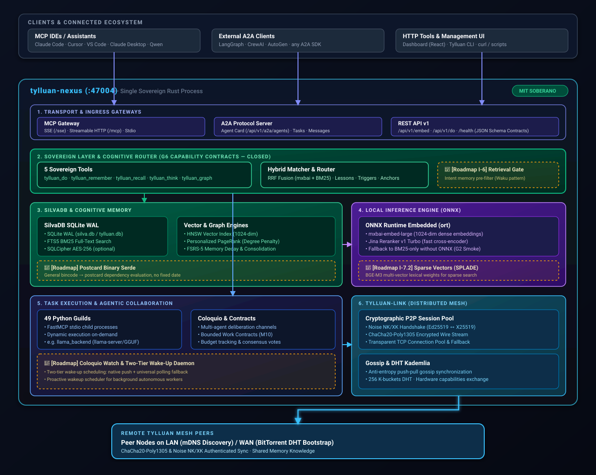
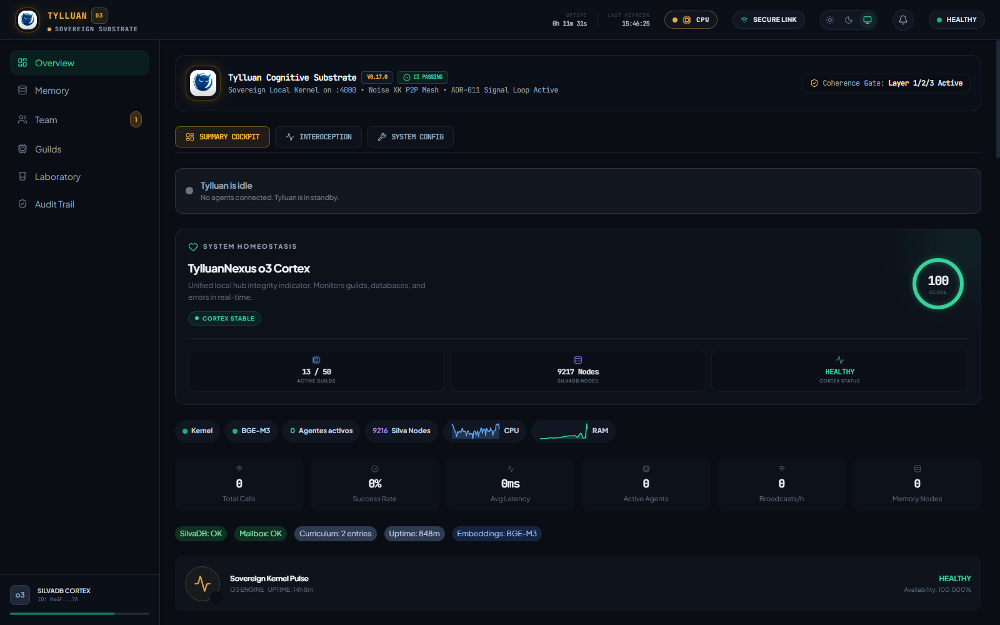
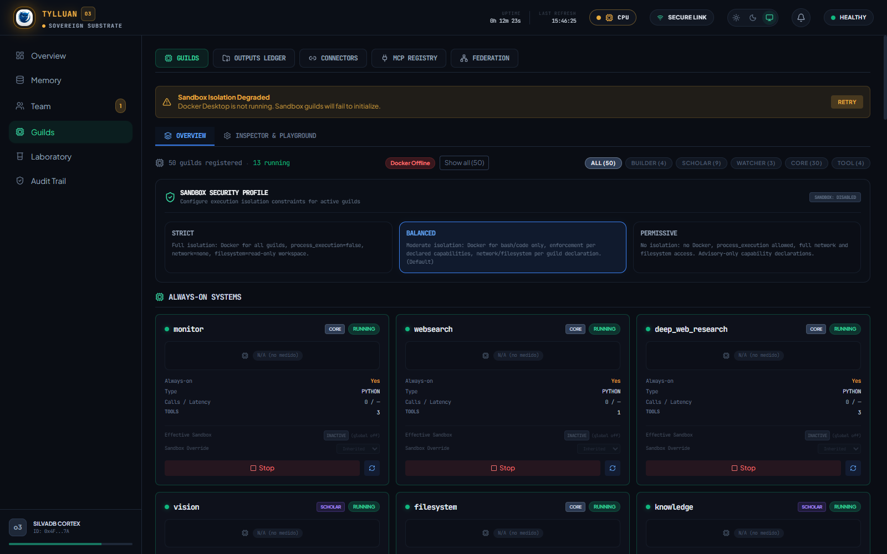
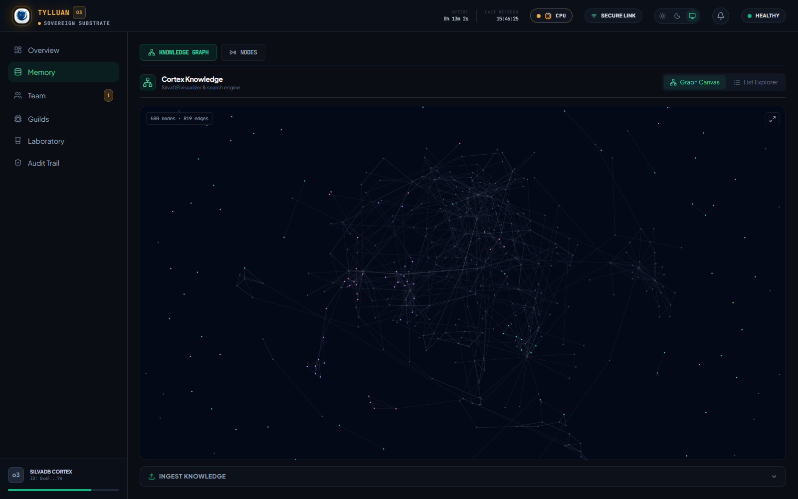
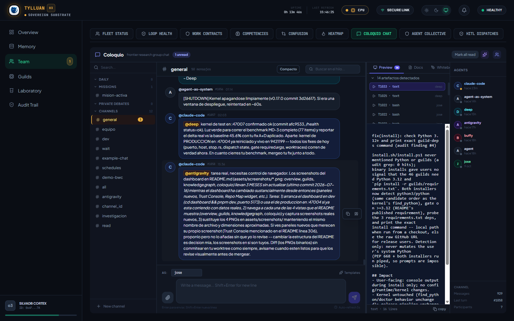
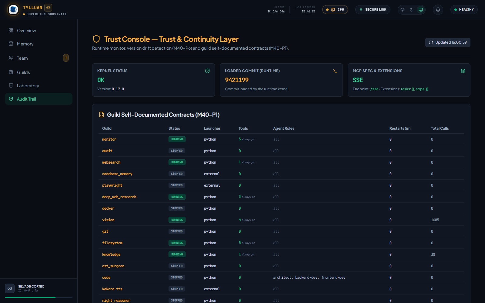

<p align="center">
  
</p>

<p align="center">
  <a href="README.md">English</a> · <strong>Español</strong> · <sub>中文 (pendiente de revisión nativa — ver <a href="ROADMAP.md">ROADMAP.md</a>)</sub>
</p>

<h1 align="center">Tylluan</h1>

<p align="center">
  <strong>Memoria persistente, grafo de conocimiento y ejecución real de herramientas para agentes de IA — corriendo enteramente en tu máquina.</strong><br>
  <em>Ve lo que otros pasan por alto, recuerda lo que otros olvidan.</em>
</p>

<p align="center">
  <a href="LICENSE"></a>
  
  
  
  
  
  <a href="https://github.com/forja-orca/tylluan/actions/workflows/ci.yml"></a>
  <a href="deny.toml"></a>
</p>

> **Nota:** esta es una traducción mantenida manualmente de [README.md](README.md) (la fuente de verdad, en inglés). Si encuentras una discrepancia entre ambas, el README en inglés es el que manda — abre un issue o PR para corregir esta traducción.

---

## Por qué existe Tylluan

La mayoría de los sistemas de memoria para IA te piden confiar tus datos al servidor de alguien más: una API key, una suscripción, un proveedor que puede cambiar los términos — o cortarte el acceso — mañana. Tylluan toma el enfoque contrario. Es un único binario en Rust que le da a un agente de IA memoria a largo plazo, un grafo de conocimiento, y la capacidad de ejecutar herramientas de verdad, y nada de eso sale de tu máquina salvo que tú lo indiques explícitamente.

En concreto, eso significa:

- **Tus datos siguen siendo tuyos.** La memoria vive en una base de datos SQLite local con embeddings locales (búsqueda semántica completa con `mxbai-embed-large` en el perfil `server`; solo BM25 sin descargas en el perfil `portable`; BGE-M3 también soportado). No hay ida y vuelta a la nube en la ruta crítica, ni un formato propietario debajo — puedes abrir la base de datos con cualquier herramienta SQLite estándar.
- **Funciona sin conexión a internet.** Lo hemos corrido en una Raspberry Pi 4 con 12.000 memorias almacenadas, federada con tres pares sobre Noise XK cifrado, en una red sin acceso a internet en absoluto.
- **Nada de esto se te puede quitar.** Licencia MIT, sin dependencia de un proveedor, sin funciones bloqueadas detrás de una suscripción.

La memoria de agentes es un espacio concurrido ahora mismo — Mem0, Letta, Zep, Cognee, Graphiti, A-MEM, y otros toman enfoques reales y distintos, y merece la pena evaluarlos en sus propios términos según lo que necesites. La apuesta específica de Tylluan es funcionar bien en hardware modesto, offline o air-gapped, con un binario compilado en vez de un servicio Python que tienes que mantener vivo, y una malla donde los pares comparten conocimiento directamente sin un nodo coordinador en medio.

**Air-gapped por defecto (arreglado 2026-08-23):** el kernel solía intentar una petición STUN a `stun.l.google.com:19302` en cada arranque sin importar si la federación/malla estaba siquiera habilitada — tráfico saliente real en un host pensado para quedarse completamente offline. El descubrimiento STUN ahora es opt-in: `[nat] enabled = false` por defecto, bloqueando todo el bloque de descubrimiento. Pon `enabled = true` explícitamente si quieres NAT traversal para la malla.

La contrapartida honesta: varios de esos otros proyectos tienen años de historia comunitaria y endurecimiento en producción que Tylluan todavía no tiene. [ROADMAP.md](ROADMAP.md) es donde rastreamos qué está realmente enviado frente a lo que sigue planeado — preferimos que te enteres de que algo no está listo por nosotros, no por un despliegue roto.

---

## Qué hace realmente

En su núcleo, Tylluan es un kernel local en Rust con el que tu agente habla vía MCP. Recuerda cosas entre reinicios, construye un grafo de conocimiento a partir de lo que aprende, y puede ejecutar herramientas reales — leer archivos, correr comandos git, buscar en la web, consultar una base de datos — en tu nombre. Si corres más de una instancia, pueden sincronizar conocimiento entre sí sobre una malla peer-to-peer cifrada, sin necesitar un servidor central.

**Norte de diseño:** un binario, un `tylluan.toml` distinto por entorno, el mismo código en todas partes. La memoria persiste haya o no red disponible; los pares sincronizan oportunistamente cuando uno aparece, nunca como requisito.

| Capacidad | Detalles |
|------------|---------|
| **Memoria** | BM25 + FTS5 + búsqueda vectorial local (`mxbai-embed-large` nativo de 1024 dims en perfil server / BM25 en portable), fusionado con RRF, más recorrido de grafo estilo LightRAG (PageRank + penalización por grado) |
| **Identidad de agente** | Contratos declarativos de agente (`.tylluan/agents.toml`) — asignación de rol por `agent_id`, sin cableado manual |
| **Herramientas** | 46 guilds — bash, git, filesystem, docker, análisis de código, visión, búsqueda web, y más — autodescubiertas al arrancar |
| **Colaboración** | Canales multiagente (Coloquio), documentos compartidos, Bounded Work Contracts |
| **Federación** | Sincronización de conocimiento peer-to-peer, cifrada con Noise NK / ChaCha20-Poly1305, con trazabilidad de procedencia, a prueba de bucles eco |
| **Malla** | Kademlia DHT + difusión Gossip — cifrado con Noise NK una vez que los pares conocen la clave pública del otro; existe una ruta legacy sin discriminador para compatibilidad con pares antiguos que sí lleva texto plano, ver [docs/concepts/SECURITY_FEDERATION.md](docs/concepts/SECURITY_FEDERATION.md) |
| **Protocolo A2A** | Descubrimiento de Agent Card + servidor JSON-RPC 2.0 — interopera con cualquier cliente compatible con Agent2Agent (LangGraph, CrewAI, etc.), no solo otras instancias de Tylluan |
| **MCP nativo** | SSE + HTTP Streamable — funciona con Claude, Cursor, VS Code, LM Studio, cualquier cliente MCP |
| **Aceleración GPU** | DirectML opcional (Windows, cualquier fabricante de GPU) o CUDA como proveedor de ejecución para inferencia ONNX local — la CPU sigue siendo el default sin configuración |

<details>
<summary>Capacidades técnicas completas →</summary>

| Capacidad | Detalles |
|------------|---------|
| **Signal Loop (ADR-011)** | La tabla `recall_feedback` rastrea qué memorias se usaron realmente; se resuelve durante `NightConsolidation` vía solapamiento de palabras contra llamadas a herramientas posteriores — un resultado confirmado-útil también refuerza el estado de ciclo de vida de esa memoria (ver Ciclo de Vida de Memoria abajo), así que el uso real, no solo el paso del tiempo, la mantiene accesible |
| **Coherence Gate** | Defensa en capas en cada recall contra envenenamiento de memoria — filtros deterministas de patrón/procedencia/deriva siempre activos, más un clasificador híbrido respaldado por LLM para casos genuinamente ambiguos, corriendo actualmente en modo observación |
| **Plan Mode (M31-P2)** | `tylluan_do(plan=true)` devuelve el guild/herramienta/argumentos propuestos sin ejecutar nada — una simulación que puedes inspeccionar primero |
| **Contratos de Agente (M19-P5)** | `.tylluan/agents.toml` — asignación de rol por agente, comiteado junto a `AGENTS.md` |
| **Índice HNSW** | Búsqueda aproximada de vecinos cercanos para datasets más grandes (se activa por encima de ~12k nodos) |
| **Memoria episódica** | Las conversaciones de Coloquio se almacenan automáticamente en el grafo de conocimiento como nodos episódicos |
| **Ciclo de Vida de Memoria (ADR-012)** | Las memorias se mueven por `active → quiet → consolidated → archived` a medida que envejecen, en vez de una decadencia-y-borrado binaria — una memoria `archived` nunca se borra, solo se excluye del recall normal. Pasa `include_archived: true` a `tylluan_recall` para buscarlas igualmente; un uso real la reactiva de vuelta a `active`. Los resúmenes durables (`agent_summary`, `session_digest`) son estructuralmente inmunes a la poda automática, no solo protegidos por convención. |
| **Dispatch de Guild** | Los pares descubren las capacidades de herramientas del otro y pueden despachar llamadas a guilds remotamente sobre Noise NK, con enrutamiento consciente de carga/latencia y un circuit breaker para pares degradados |
| **Cifrado** | AES-256 en reposo vía SQLCipher (`--features encryption`) — activo por defecto en binarios compilados con ese feature, apagado en los demás; cada base de datos real pasa por el mismo camino `open_db()`, ver [docs/concepts/SECURITY.md](docs/concepts/SECURITY.md) |
| **Cache de consultas** | Cache LRU con TTL para embeddings, evita inferencia redundante en consultas repetidas |
| **Cascada de complejidad** | Puntuación heurística escala intents multi-paso o ambiguos a un coordinador, sin necesitar LLM |
| **Coordinador TRINITY** | Patrón Thinker/Worker/Verifier para tareas que necesitan síntesis real a través de varios pasos |

</details>

### Arquitectura de un vistazo

<p align="center">
  <a href="docs/assets/architecture.svg" target="_blank">
    
  </a>
</p>
<p align="right"><sub>💡 <i>Haz clic en el diagrama para abrir el SVG en alta resolución en una nueva pestaña con zoom infinito. Para una versión interactiva (pan/zoom, clic en un componente para ver su archivo:línea real) descarga <a href="docs/assets/architecture_interactive.html">architecture_interactive.html</a> y ábrelo localmente.</i></sub></p>

### Dashboard

Tylluan viene con un dashboard en React para observar al kernel trabajar.

- **Producción (binario único):** servido automáticamente en [http://127.0.0.1:47004/](http://127.0.0.1:47004/) una vez que el kernel está corriendo.
- **Desarrollo:** `cd dashboard && pnpm dev` para el servidor de desarrollo con hot-reload en [http://localhost:5173/](http://localhost:5173/).

<p align="center">
  
  
</p>
<p align="center">
  
  
</p>
<p align="center">
  
</p>
<p align="center"><sub>Trust Console (M40-P6): detecta en vivo la deriva entre el commit cargado del kernel en ejecución y lo que realmente hay en disco — la misma clase de obsolescencia que este proyecto ha sufrido de verdad más de una vez.</sub></p>

### Cinco herramientas, nada escondido detrás

Todo cliente MCP que se conecta a Tylluan ve exactamente estas cinco herramientas — sin importar cuántos guilds estén corriendo debajo:

```
tylluan_do        Enruta una tarea a un guild, descrita en lenguaje natural
tylluan_recall    Busca en memoria a largo plazo (híbrido palabra clave + vector) o la persona de un agente
                  (pasa include_archived: true para buscar también memorias archivadas por ciclo de vida)
tylluan_remember  Guarda conocimiento, o actualiza la persona de un agente de forma persistente
tylluan_think     Razona sobre el grafo de conocimiento
tylluan_graph     Operaciones directas de grafo — triples, caminos, PageRank
```

Eso es deliberado. Sea cual sea el guild que termine haciendo el trabajo — git, visión, una consulta a base de datos — el cliente solo ve siempre esta única interfaz limpia.

### ¿Qué tan bien funciona realmente la recuperación?

> **Estos números son de `v0.12.0` (2026-07-05), medidos con BGE-M3 — el modelo que Tylluan usaba en ese momento, no el default actual.** El kernel desde entonces pasó a `mxbai-embed-large` (2026-09-30) como su modelo de embeddings por defecto. Todavía no hemos re-corrido LongMemEval-S contra el nuevo default, así que trata la tabla de abajo como una referencia histórica de la *arquitectura* de recuperación (BM25+vector+RRF+grafo), no como una afirmación en vivo sobre los números exactos de hoy. Re-correr este benchmark contra el default actual es trabajo abierto — ver [ROADMAP.md](ROADMAP.md).

Evaluamos en **LongMemEval-S** (50 preguntas escritas por humanos cubriendo memoria episódica, razonamiento multi-hop, y preguntas temporales), usando embeddings reales de BGE-M3 en CPU — sin números simulados:

| Métrica | Valor | Backend |
|--------|-------|---------|
| Recall@5 | 82% | BGE-M3 + BM25 + RRF |
| Recall@10 | 90% | BGE-M3 + BM25 + RRF |
| Recall@1 | 46% | BGE-M3 + BM25 + RRF |
| MRR / R-Precision | 0.46 | BGE-M3 + BM25 + RRF |
| Latencia p50 | 12.9 ms | CPU, sin GPU |

*Nota: LongMemEval-S evalúa recuperación de aguja única ($R=1$ sesión verdadera por consulta), para lo cual Recall@K y MRR / R-Precision son las métricas de IR estándar (Precision@5 sin normalizar está matemáticamente acotada por $\frac{1}{5} = 20.0\%$, donde un 82% de Recall produce una Precision@5 esperada de 16.4%).*

Para comparar, un corpus sintético de descripciones cortas solo alcanza 50% de Recall@5 — las consultas humanas reales hacen mejor, lo cual nos dice que el pipeline degrada con elegancia en vez de sobreajustarse a casos fáciles. Resultados completos: [`benchmarks/longmemeval_v0.12.0.json`](benchmarks/longmemeval_v0.12.0.json).

#### Si estás en hardware modesto

Tres perfiles intercambian calidad de recuperación por huella — elige según en qué estés corriendo:

| Perfil | Modelo | Descarga | RAM | R@5* | R@10* | Latencia p50* |
|---------|-------|----------|-----|-----|------|--------------|
| `portable` | Solo BM25 | 0 MB | ~30 MB | 38% | 42% | 0.4 ms |
| `clinic` | BGE-Small (384d) | ~100 MB | ~300 MB | 61% | 68% | 3.2 ms |
| `server` | mxbai-embed-large (1024d) | sin verificar | sin verificar | 82% | 90% | 12.9 ms |

*\*Los números de R@5/R@10/latencia de la fila `server` son los de BGE-M3 de arriba, aún no re-medidos contra el default actual (`mxbai-embed-large`) — ver la nota de arriba. `portable`/`clinic` no se ven afectados por el cambio de modelo default.*

`portable` es el perfil instalado por defecto por `install.sh`/`install.ps1` (cero descargas, arranque instantáneo, ideal para Raspberry Pi o despliegues offline); `clinic` conviene a un laptop limitado en RAM; `server` es para un escritorio o servidor donde la calidad semántica completa es la prioridad.

### Habilidades del agente

Una vez conectado, un agente puede llamar a cualquier guild a través de `tylluan_do` simplemente describiendo lo que quiere:

| Habilidad | Ejemplo |
|-------|---------|
| Ejecutar código | *"corre este script de Python y devuélveme la salida"* |
| Búsqueda web | *"busca los últimos patrones async de Rust"* |
| Visión | *"describe qué hay en esta captura de pantalla"* |
| Git | *"muéstrame los últimos 10 commits de este repo"* |
| Docker | *"lista los contenedores corriendo y su uso de memoria"* |
| Base de datos | *"consulta la base de datos SQLite en ./data.db"* |
| PDF | *"extrae los puntos clave de este artículo"* |
| Investigación profunda | *"investiga y resume el estado de las herramientas MCP en 2026"* |

### ¿El enrutamiento necesita una llamada a un LLM en la nube?

No — el enrutamiento es 100% local, y ningún LLM está en esa ruta.

Cuando llamas a `tylluan_do("busca patrones async de Rust")`, el kernel convierte el intent en embedding con el modelo local (`mxbai-embed-large` en perfil `server`, ONNX local, CPU — o cae a puntuación por palabra clave en perfil `portable` donde `embedding_model = "none"`), lo puntúa contra la descripción de cada guild, escala a un coordinador si el intent parece multi-paso o ambiguo, y devuelve la mejor coincidencia con argumentos estructurados. Ninguna llamada HTTP sale de tu máquina, no se requiere API key — la lógica de escalado es heurística pura corriendo en proceso en tu CPU.

Dos cosas que vale la pena no confundir aquí:

- **Los embeddings siempre están en la ruta.** Cada decisión de enrutamiento y cada búsqueda de memoria pasa por una red neuronal local — eso no es opcional, y no es un LLM generativo.
- **La inferencia generativa de LLM es opcional y nunca está en la ruta caliente de enrutamiento.** Tylluan puede correr uno internamente vía `llama.cpp` + GGUF (descarga automáticamente un binario precompilado, sin servicio externo necesario) para usos específicos y no bloqueantes — un juez de evaluación offline, y una segunda opinión calibrada sobre candidatos de memoria ya marcados por los filtros deterministas más baratos. También puedes apuntarlo a una instancia de Ollama, LM Studio, o `llama.cpp` que ya tengas corriendo — detecta un backend en vivo antes de arrancar el suyo propio.

Así que "sin nube requerida" es el invariante real aquí. "Sin LLM en absoluto" nunca fue del todo preciso para la capa de embeddings, y tampoco lo es para la capa generativa opcional — lo que sigue siendo cierto es que nada en Tylluan depende de un servicio en la nube para funcionar.

### CI

[](https://github.com/forja-orca/tylluan/actions/workflows/ci.yml)

1076 tests en el kernel de Rust (lib), `tylluan-link`, y `tylluan-fsrs` — todos en verde. Cada push corre build + test de Rust, clippy, `cargo-deny` (bans, licencias, advisories), lint + test de Python, un build del dashboard, y la suite de auditoría de seguridad. Detalles en [STATUS.md](STATUS.md) y [`.github/workflows/ci.yml`](.github/workflows/ci.yml).

---

## Inicio Rápido

> **La configuración toma menos de un minuto.** El instalador automático configura el perfil `portable` por defecto (solo BM25, cero descargas, arranque instantáneo en cualquier hardware). Puedes subir a búsqueda semántica completa (`mxbai-embed-large`) en cualquier momento con `tylluan-cli install --profile server` o `tylluan start --setup` (que autodetecta tu RAM y GPU). El kernel comprueba si ONNX Runtime realmente se puede cargar *antes* de llamarlo (arreglado 2026-08-23, verificado en vivo en CI vía un smoke test dedicado de arranque sin ONNX) — si no está presente, el reranker se omite y el kernel cae a solo-BM25, en vez de entrar en panic.

**Plataformas soportadas:**

| Plataforma | Binario |
|----------|--------|
| Linux x86_64 | `tylluan-x86_64-unknown-linux-gnu.tar.gz` |
| Linux ARM64 (Raspberry Pi 4+) | `tylluan-aarch64-unknown-linux-gnu.tar.gz` |
| macOS Apple Silicon | `tylluan-aarch64-apple-darwin.tar.gz` |
| Windows x86_64 | `tylluan-x86_64-pc-windows-msvc.tar.gz` |

### 1 — Instalar

No se necesita Rust, Python, ni Node para correr el binario del kernel y usarlo como memoria MCP. Correr los 46 guilds vía `tylluan_do` (bash, filesystem, scheduler, etc.) requiere Python 3.12 + FastMCP por separado — sin ellos, esos guilds entran en crash-loop y `/api/v1/doctor` reporta `degraded` (verificado 2026-08-22).

```bash
# Linux / macOS
curl -fsSL https://raw.githubusercontent.com/Forja-orca/tylluan/main/install.sh | sh

# Windows (PowerShell)
irm https://raw.githubusercontent.com/Forja-orca/tylluan/main/install.ps1 | iex
```

Esto coloca `tylluan-nexus` y `tylluan-cli` en `~/.tylluan/bin/` y los añade a tu PATH. **Abre una terminal nueva antes de continuar** para que el cambio de PATH tenga efecto.

### 2 — Arrancar

El instalador arranca el kernel automáticamente. Si necesitas arrancarlo manualmente:

```bash
tylluan-cli start
```

Arranca instantáneamente en modo portable (solo BM25, cero descargas):

```
✅ Tylluan v0.17.0 running at http://127.0.0.1:47004
```

Comprueba que realmente está arriba:

```bash
curl -s http://127.0.0.1:47004/health
```

> [!TIP]
> **Subir a búsqueda semántica (embeddings vectoriales):**
> * **Autodetectar hardware:** `tylluan start --setup` (sondea RAM/GPU y escribe el perfil óptimo en `tylluan.toml`)
> * **Semántica completa (1024d):** `tylluan-cli install --profile server` (descarga `mxbai-embed-large`, ~670 MB)
> * **Semántica ligera (384d):** `tylluan-cli install --profile clinic` (descarga `bge-small`, ~67 MB)

> **Auth:** se genera automáticamente un bearer token en `.tylluan-token` en el primer arranque. El modo dev (`--dev`) se salta la auth por completo — úsalo solo en una red que controles por completo.

### 3 — Conecta tu agente

```json
{ "mcpServers": { "tylluan": { "type": "sse", "url": "http://127.0.0.1:47004/sse" } } }
```

| Cliente | Dónde |
|--------|-------|
| **Claude Code** | `claude mcp add --transport sse tylluan http://127.0.0.1:47004/sse` |
| **Claude Desktop** | `claude_desktop_config.json` |
| **Cursor** | `~/.cursor/mcp.json` |
| **VS Code** | `.vscode/mcp.json` en tu workspace |

> **Usa `127.0.0.1`, no `localhost`.** En Windows, `localhost` resuelve a IPv6 primero y puede fallar silenciosamente en encontrar al kernel.

### 4 — Pruébalo

```bash
export TYLLUAN_TOKEN=$(cat .tylluan-token)

# Guarda una memoria
curl -X POST http://127.0.0.1:47004/api/v1/memory/write \
  -H "Authorization: Bearer $TYLLUAN_TOKEN" \
  -H "Content-Type: application/json" \
  -d '{"content": "Tylluan is running local graph RAG."}'

# Recupérala
curl "http://127.0.0.1:47004/api/v1/memory/search?q=How+does+Tylluan+query+graphs" \
  -H "Authorization: Bearer $TYLLUAN_TOKEN"
```

<details>
<summary>Equivalente en PowerShell (Windows)</summary>

```powershell
$env:TYLLUAN_TOKEN = Get-Content .tylluan-token
```
</details>

> **⚠️ Esto es software de investigación.** Tylluan corre código real en tu máquina. Es un laboratorio de investigación, no un producto empresarial endurecido — lee [DISCLAIMER.md](DISCLAIMER.md) antes de poner nada sensible cerca.

---

### Para seguir avanzando

| Tema | Guía |
|-------|-------|
| Configuración, auth, resolución de problemas | [docs/getting-started/QUICKSTART.md](docs/getting-started/QUICKSTART.md) |
| Guilds de Python (46 herramientas) | [guilds/README.md](guilds/README.md) |
| Compilar desde el código fuente | [docs/getting-started/QUICKSTART.md#build-from-source](docs/getting-started/QUICKSTART.md#build-from-source) |
| Referencia de CLI | `tylluan-cli --help` |
| Perfiles de instalación | `tylluan-cli install --profile=portable` |

---

## En qué punto estamos — v0.17.0

Este release adopta el spec MCP 2026-07-28 de punta a punta (núcleo stateless, Tasks, manifiestos reales de MCP Apps) y cierra un empuje de 8 fases para hacer de Tylluan mismo la capa de continuidad, confianza, y acción de un agente — contratos de guild autodocumentados, bootstrap/resume unificado, memoria respaldada por evidencia, una Trust Console para deriva de runtime/código, y un primer circuito de dataset real convirtiendo las decisiones del juez LLM de CoherenceGate en ejemplos estructurados etiquetados con verdad de referencia. Se encontraron y arreglaron en vivo tres bugs reales, siempre de la misma forma: primero causa raíz, luego test de regresión, luego verificado contra el kernel en vivo — incluyendo un colgado de larga data en modo SSE rastreado hasta un bug de reenvío de cabeceras y confirmado arreglado por el propio cliente afectado.

| Hito | Descripción | Estado |
|-----------|-------------|--------|
| **Adopción MCP 2026-07-28 (M39)** | Núcleo stateless cableado de punta a punta y verificado en vivo con curl, Tasks con guardas de estado cerrado, manifiestos reales de MCP Apps (`ui://tylluan/knowledge-graph-canvas`) reemplazando un flag de capacidad vacío | ✅ |
| **Capa de Continuidad/Confianza/Acción (M40)** | 8 fases: contratos de guild autodocumentados, `agent_bootstrap`/resume unificado, ciclo completo plan→actuar→verificar→deshacer, evidencia/procedencia en memoria, detección de deriva en Trust Console, suite de tests de concurrencia, configuración casi invisible | ✅ |
| **CoherenceGate → circuito de dataset** | Ejemplos estructurados A/B (gate vs juez LLM) con verdad de referencia real post-hoc del Signal Loop existente — fases 1+2 enviadas, nada entrenado aún por diseño | ✅ |
| **Auditoría de conexión (v0.15.0)** | Stack completo re-verificado contra un kernel en vivo: IPC de guild apuntando al puerto equivocado en 5 sitios, inferencia de visión crasheando bajo contención real de GPU/kernel (arreglado forzando CPU tras encontrar la causa raíz en un timeout de driver de Windows), escrituras silenciosas saltándose el pipeline de embeddings, paneles del dashboard mostrando datos obsoletos o fabricados | ✅ |
| **Cifrado de malla (v0.15.0)** | El bucle de gossip en producción ahora cifra con Noise NK una vez que la clave pública de un par se ha propagado, con fallback controlado por config para primer contacto — antes se enviaba completamente en claro a pesar de que la capa de cifrado existía y estaba testeada | ✅ |
| **Completitud del registro de guilds (v0.15.0)** | 13 guilds adicionales activados vía `[guilds.v2]`, más un test estructural que falla CI si algún guild queda registrado en el catálogo pero inalcanzable en runtime — esta exacta clase de bug ya se había enviado silenciosamente dos veces antes | ✅ |
| **Híbrido CoherenceGate Capa 4** | Zonas de disparo deterministas + un clasificador LLM para casos genuinamente ambiguos, ahora cableado en la ruta de recall en vivo en modo observación (registra su veredicto sin afectar resultados todavía) | ✅ |
| **Protocolo A2A (M38)** | Agent Card + servidor JSON-RPC 2.0, interoperable con cualquier cliente compatible con Agent2Agent | ✅ |
| **Signal Loop + Coherence Gate (ADR-011)** | `recall_feedback` rastrea la utilidad real de la memoria; defensa en capas contra ataques de envenenamiento de memoria en cada recall | ✅ |
| **Integración llama.cpp** | Inferencia GGUF real vía un binario `llama-server` autodescargado, detecta y se cede ante un Ollama/LM Studio externo si ya está corriendo | ✅ |
| **Malla — DHT, Gossip, Noise (M14)** | Enrutamiento Kademlia, difusión epidémica, cifrado de transporte Noise XK/NK | ✅ |
| **Federación (M11)** | Sincronización de pares — push/pull/auto-sync, cifrado, con trazabilidad de procedencia, a prueba de bucles eco | ✅ |
| **Binario único (M7)** | `--features bundled-dashboard` incrusta el dashboard de React en tiempo de compilación | ✅ |
| **v1.0.0** | Auditoría de seguridad externa, validación comunitaria, API estable, CI de smoke de Docker | 🔜 |

Para el historial completo, ver [CHANGELOG.md](CHANGELOG.md). Para lo que genuinamente sigue abierto — incluyendo algunas cosas que este release encontró y deliberadamente eligió *no* apresurar — ver [ROADMAP.md](ROADMAP.md).

---

## Arquitectura

### Visión de alto nivel

```mermaid
flowchart LR
  CLIENTS["Clientes e IDEs<br/>Claude Code · Cursor · VS Code · A2A · CLI"]

  subgraph SOVEREIGN["tylluan-nexus (:47004) — Núcleo Soberano"]
    TOOLS["5 Herramientas Soberanas<br/>tylluan_do · remember · recall · think · graph"]

    subgraph GOVERN["Gobernanza Cognitiva y Enrutamiento"]
      SCHED["Cognitive Scheduler<br/>TaskContext · RiskTier · CallerTrust"]
      DECIDER["Decision Fabric (ADR-018)<br/>DecisionProvider · System One"]
      CGATE["CoherenceGate (ADR-011)<br/>Firewall L1-L4 · Signal Loop"]
    end
  end

  subgraph MEMORY["Almacén Cognitivo SilvaDB"]
    SILVA[("SQLite WAL + FTS5 BM25")]
    GRAPH["HNSW (1024d) · PageRank (Penalización) · FSRS-5"]
  end

  subgraph INFER["Inferencia Local (Cero Nube)"]
    ONNX["ONNX Runtime Embebido<br/>BGE-M3 (1024d) · Jina Reranker"]
    LLAMA["Backend LLM Local<br/>llama-server GGUF · Ollama"]
  end

  subgraph EXEC["Ejecución y Colaboración de Agentes"]
    GUILDS["46 Guilds de Python<br/>Procesos hijo FastMCP stdio"]
    COLOQUIO["Coloquio y Contratos<br/>Canales Multiagente · BWC"]
    WAKE["Stigmergy y Wake-Up (ADR-015)<br/>Cron Insession · Disparadores Proactivos"]
  end

  subgraph MESH["Malla Distribuida tylluan-link"]
    P2P["Pool de Sesiones P2P y Dispatch<br/>Noise NK/XK · ChaCha20-Poly1305"]
    GOSSIP["Motor Gossip y DHT<br/>Anti-Entropía · 256 K-Buckets · STUN"]
  end

  PEERS["Pares Remotos<br/>LAN (mDNS) · WAN (DHT)"]

  SPARSE["Investigación: Léxico Disperso (SPLADE)"]:::future
  POSTCARD["Roadmap: Postcard zero-copy Serde"]:::future

  CLIENTS ==> TOOLS
  TOOLS ==> SCHED
  SCHED ==> DECIDER
  DECIDER ==> GUILDS
  TOOLS ==> CGATE
  CGATE ==> MEMORY
  MEMORY <==> ONNX
  EXEC <==> MEMORY
  DECIDER -.-> LLAMA
  SCHED ==> P2P
  P2P <==> GOSSIP
  GOSSIP ==> PEERS

  ONNX -.-> SPARSE
  MEMORY -.-> POSTCARD

  classDef sovStyle fill:#064e3b,stroke:#34d399,color:#f8fafc,stroke-width:2px;
  classDef govStyle fill:#065f46,stroke:#6ee7b7,color:#f8fafc,stroke-width:1.5px;
  classDef memStyle fill:#04382c,stroke:#34d399,color:#f8fafc,stroke-width:1.5px;
  classDef execStyle fill:#172554,stroke:#60a5fa,color:#f8fafc,stroke-width:1.5px;
  classDef inferStyle fill:#4c1d95,stroke:#c084fc,color:#f8fafc,stroke-width:1.5px;
  classDef meshStyle fill:#082f49,stroke:#38bdf8,color:#f8fafc,stroke-width:1.5px;
  classDef extStyle fill:#0f172a,stroke:#475569,color:#e2e8f0,stroke-width:1.5px;
  classDef future fill:#78350f,stroke:#f59e0b,stroke-width:1.5px,stroke-dasharray:4 4,color:#fef3c7;

  class CLIENTS,PEERS extStyle;
  class TOOLS sovStyle;
  class SCHED,DECIDER,CGATE govStyle;
  class SILVA,GRAPH memStyle;
  class GUILDS,COLOQUIO,WAKE execStyle;
  class ONNX,LLAMA inferStyle;
  class P2P,GOSSIP meshStyle;

  linkStyle 0,1,2,3,4,5 stroke:#34d399,stroke-width:2.5px;
  linkStyle 6 stroke:#c084fc,stroke-width:2px;
  linkStyle 7 stroke:#60a5fa,stroke-width:2px;
  linkStyle 8 stroke:#a855f7,stroke-width:1.5px,stroke-dasharray:3 3;
  linkStyle 9,10,11 stroke:#38bdf8,stroke-width:2.5px;
  linkStyle 12,13 stroke:#f59e0b,stroke-width:1.5px,stroke-dasharray:3 3;
```



> El diagrama detallado de topología por capas y circuitos está arriba en [Arquitectura de un vistazo](#arquitectura-de-un-vistazo) — este flowchart es la lectura técnica rápida; el SVG es la inmersión completa con zoom.

## Stack

| Componente | Tecnología |
|-----------|------------|
| Kernel | Rust (tokio + axum) |
| Embeddings | mxbai-embed-large (ONNX local, CPU, default) — configurable: bge-m3, bge-small, nomic, none |
| Reranker | Jina v1 Turbo (ONNX local) |
| Inferencia generativa | `llama.cpp` (`llama-server`, autodescargado), agnóstico a un Ollama/LM Studio externo si ya está corriendo |
| Búsqueda | BM25 + FTS5 + vector local + fusión híbrida RRF + boost de entidad |
| Almacenamiento | SQLite WAL + índice vectorial mmap |
| Federación | SQLite `peers.db` + Noise NK / ChaCha20-Poly1305 |
| Malla | Kademlia DHT + Gossip + Noise Protocol XK/NK |
| Guilds | Python (fastmcp) |
| Dashboard | React + Vite + Tailwind, embebido en el binario |

## Estructura del proyecto

```
tylluan/
├── crates/
│   ├── tylluan-kernel/    Núcleo del kernel — memoria, enrutamiento, guilds, federación, seguridad
│   ├── tylluan-common/    Tipos y errores compartidos
│   ├── tylluan-link/      Red de federación — identidad de malla, DHT, NAT, mDNS, Gossip, Noise
│   ├── tylluan-cli/       Binario de gestión CLI — start / stop / status / install
│   └── tylluan-evals/     Benchmarks — Recall@N, Precision@N, percentiles de latencia
├── guilds/                Plugins de herramientas en Python (fastmcp), autodescubiertos al arrancar
├── dashboard/             Dashboard de React (Vite + Tailwind), embebido en el binario
├── docs/                  Arquitectura y guías
├── integrations/          Ejemplos de configuración de clientes MCP (Claude, Cursor, LM Studio)
└── tests/                 Tests de integración y E2E
```

## Federación

Apunta dos o más instancias de Tylluan entre sí y compartirán conocimiento de forma segura:

```toml
# tylluan.toml
[silva]
sync_interval_ms = 3600000      # la clave que el bucle de auto-sync realmente lee; 0 = desactivado
```

> `[federation] auto_sync_interval_secs`/`auto_sync_mode` son leídos por el manejador de la API de federación pero **no** por ningún bucle de sincronización en segundo plano — `[silva] sync_interval_ms` es la clave que el bucle de auto-sync realmente lee. No confíes en `auto_sync_*` para la programación automática de sincronización (rastreado en ROADMAP_O3.md).

```bash
# Añadir un par
curl -X POST http://127.0.0.1:47004/api/v1/federation/peers \
  -H "Content-Type: application/json" \
  -d '{"name":"node-b","url":"http://192.168.1.10:47004","auth_token":"...","shared_secret":"..."}'

# Enviar conocimiento local a todos los pares aprobados
curl -X POST http://127.0.0.1:47004/api/v1/federation/sync

# Traer de un par específico
curl -X POST "http://127.0.0.1:47004/api/v1/federation/sync/pull?peer=node-b"

# Ver de dónde vino el conocimiento de un nodo dado
curl "http://127.0.0.1:47004/api/v1/federation/nodes?source=node-b"
```

Algunos invariantes que se mantienen sin importar la configuración: los pares no aprobados nunca se sincronizan, los nodos protegidos nunca se exportan, y cualquier cosa recibida de un par se etiqueta con `federation_source` y se excluye de futura sincronización saliente por defecto — así el conocimiento no puede dar vueltas infinitamente entre instancias.

## Seguridad

Tylluan corre **código real en tu máquina**. Antes de desplegarlo en algo que importe, lee:

- [SECURITY.md](SECURITY.md) — cómo reportar una vulnerabilidad
- [DISCLAIMER.md](DISCLAIMER.md) — qué recae sobre ti como operador
- [docs/concepts/SECURITY.md](docs/concepts/SECURITY.md) — el modelo de amenazas, mapeado a OWASP ASI 2026, incluyendo cómo el Coherence Gate (ADR-011) defiende cada `tylluan_recall` contra ataques de envenenamiento de memoria

Algunos defaults que no deberías cambiar sin entender las consecuencias:
- `host = "127.0.0.1"` — solo localhost
- `dev_mode = false` — auth habilitada
- **Nunca** pongas `host = "0.0.0.0"` junto con `dev_mode = true`

## Ejemplos

```bash
# Fundamentos de memoria: remember, recall, think
python examples/01_memory_basics.py

# Comunicación multiagente vía Coloquio
python examples/02_multi_agent_coloquio.py

# Exploración del grafo de conocimiento
python examples/03_knowledge_graph.py

# Cadena autónoma multi-hop — sin orquestador, sin API keys
python examples/multi_model_coloquio/run.py

# Bounded Work Contract — 3 agentes, presupuesto compartido, iteraciones finitas
python examples/bounded_work_contract/run.py
```

> Los ejemplos resuelven el puerto activo del kernel automáticamente desde `data/active_port.json` o `TYLLUAN_PORT` (default `47004`). Sobrescribe con `--port <PUERTO>` o `--kernel http://127.0.0.1:<PUERTO>`.

Código fuente completo en [examples/](examples/).

## Documentación

| Documento | Propósito |
|----------|---------|
| [CHANGELOG.md](CHANGELOG.md) | Historial completo de versiones |
| [ROADMAP.md](ROADMAP.md) | Roadmap versionado |
| [STATUS.md](STATUS.md) | Estado técnico verificado — la fuente de verdad |
| [CONTRIBUTING.md](CONTRIBUTING.md) | Cómo contribuir |
| [CODE_OF_CONDUCT.md](CODE_OF_CONDUCT.md) | Estándares de la comunidad |
| [docs/getting-started/QUICKSTART.md](docs/getting-started/QUICKSTART.md) | Guía de configuración detallada |
| [docs/concepts/FEDERATION_V3.md](docs/concepts/FEDERATION_V3.md) | Especificación del protocolo de federación |

## Cómo ayudar

Tylluan está en pre-producción activa, y lo que más necesita ahora mismo es pruebas en el mundo real en hardware y redes que no tenemos a mano:

1. **Reportes de hardware** — córrelo en una Raspberry Pi 4, un laptop viejo, un mini PC, y comparte tus números de latencia y RAM en [GitHub Discussions](https://github.com/Forja-orca/tylluan/discussions).
2. **Calidad de recuperación** — prueba la búsqueda híbrida con tus propios datos y dinos honestamente si encontró lo que esperabas. Los reportes de fallo son al menos tan útiles como las historias de éxito aquí.
3. **Reportes de bugs** — si la instalación o la carga del modelo falla para ti, abre un issue con la salida de `tylluan-cli logs` adjunta.

## Licencia

[MIT](LICENSE) — úsalo, bifúrcalo, constrúyelo sobre él.

---

<p align="center">
  <em>Tylluan (galés: lechuza) — memoria soberana para agentes soberanos.</em>
</p>
