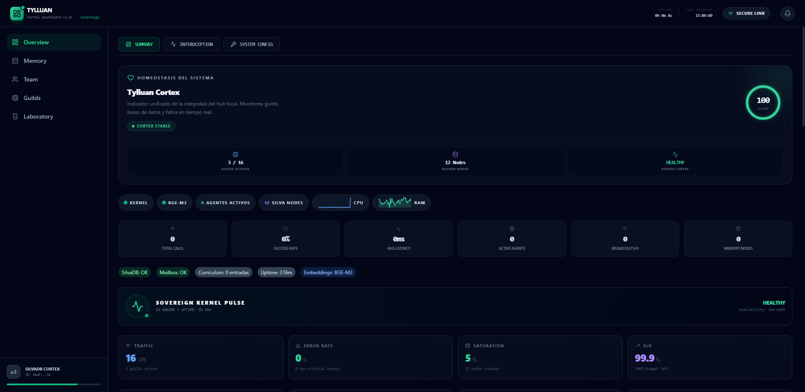
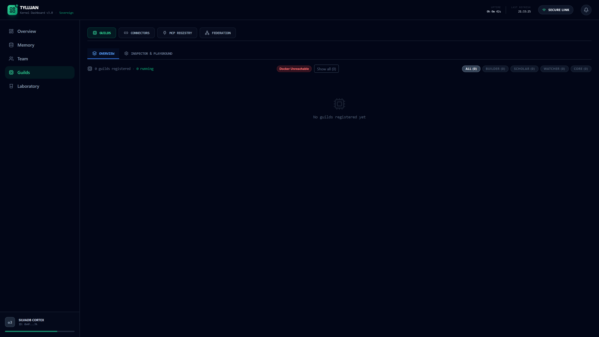
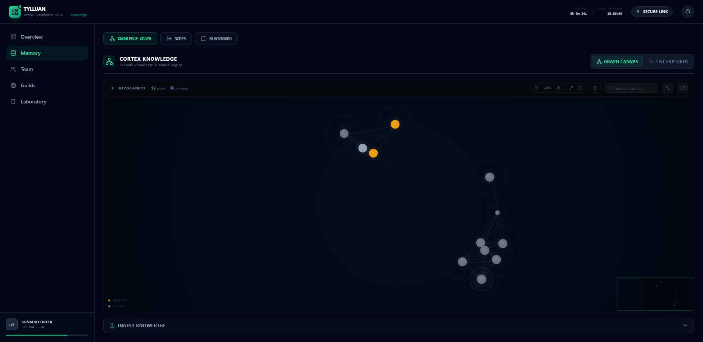
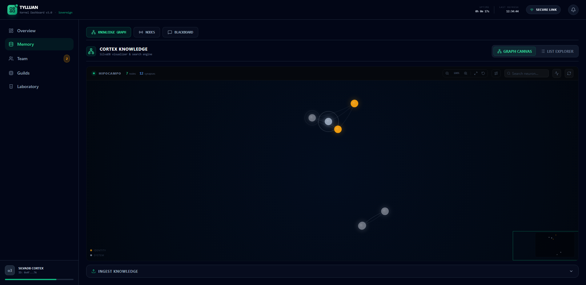

<p align="center">
  
</p>

<h1 align="center">Tylluan</h1>

<p align="center">
  <strong>Sovereign cognitive substrate for AI agents</strong><br>
  <em>Sees what others miss, remembers what others forget.</em>
</p>

<p align="center">
  <a href="LICENSE"></a>
  
  
  
  
  
  <a href="https://github.com/forja-orca/tylluan/actions/workflows/ci.yml"></a>
  <a href="deny.toml"></a>
</p>

---

> **⚠️ Experimental research software.** Tylluan executes real code on your machine. It is a research lab, not an enterprise product. Read [DISCLAIMER.md](DISCLAIMER.md) before using.

---

## What is Tylluan?

A local Rust kernel that gives AI agents **persistent memory**, a **knowledge graph**, **real tool execution**, and **federated peer sync** — all running on your machine with zero cloud dependencies.

**Design north star:** One binary, zero cloud dependencies, runs offline on a Raspberry Pi 4 or a server cluster. Different `tylluan.toml` per environment — same code. Knowledge persists across machines. Peers sync when a network is available, not as a requirement.

| Capability | Details |
|------------|---------|
| **Memory** | BM25 + FTS5 + BGE-M3 vector search with RRF hybrid fusion + **LinearRAG local graph traversal (PageRank + degree penalty)**. Entity boost ×1.25 post-RRF |
| **HNSW Index** | Fast approximate nearest neighbor search via `instant-distance` (HNSW) for large datasets (threshold >=12k nodes) |
| **Agent Persona** | Agents have `persona` + `preferences` stored in Core Memory (always available, not retrieved on demand) |
| **Episodic Memory** | Coloquio conversations automatically ingested into SilvaDB as `episodic` nodes — agents remember what was discussed |
| **Memory Decay** | Half-life exponential salience decay (T½=14d). Memories fade naturally; access reinforces them |
| **Tools** | 47+ guilds: bash, git, filesystem, docker, code, vision, web search, and more. Auto-discovered at startup |
| **Collaboration** | Multi-agent channels (Coloquio), shared documents, Bounded Work Contracts |
| **Federation** | Peer-to-peer knowledge sync over LAN/VPN — ChaCha20-Poly1305 encrypted, provenance-tracked, echo-loop safe |
| **Mesh** | DHT Kademlia peer discovery + Gossip epidemic dissemination + Noise Protocol XK encrypted transport |
| **Guild Dispatch** | Peers discover each other's capabilities (`CapabilityRegistry`) and dispatch guild tools remotely via Noise NK — `DispatchRouter` scores peers by load, latency, and GPU; circuit breaker protects against degraded peers |
| **Encryption** | AES-256 at rest via SQLCipher (feature-gated: `cargo build --features encryption`) |
| **MCP Native** | SSE + HTTP Streamable. Works with Claude, Cursor, VS Code, LM Studio |

### Dashboard

<p align="center">
  
  
</p>
<p align="center">
  
  
</p>

### 5 Sovereign Tools

Every MCP client sees exactly these tools — nothing more, nothing less:

```
tylluan_do        Route tasks to guilds via natural language
tylluan_recall    Search long-term memory (BM25+FTS5+vector hybrid) or agent persona
tylluan_remember  Store knowledge or update agent persona persistently
tylluan_think     Reason over the knowledge graph
tylluan_graph     Direct graph operations (triples, paths, PageRank)
```

### CI / Security

[](https://github.com/forja-orca/tylluan/actions/workflows/ci.yml)

Every push runs 5 jobs: Rust build+test (**356 total tests** — 273 kernel lib + 81 link + 2 evals) + clippy, cargo-deny (bans, licenses, advisories), Python lint+test (ruff + pytest), Dashboard build (pnpm), and security audit tests. [Status](STATUS.md) — all green. See [`.github/workflows/ci.yml`](.github/workflows/ci.yml).

---

## Quick Start

> **The honest toll:** First boot downloads the BGE-M3 embedding model (~2.2 GB, one-time). This is the cost of sovereign memory — no cloud, no API key, your hardware. Subsequent starts are instant. Use `embedding_model = "none"` in `tylluan.toml` for zero-download BM25-only mode.

**Supported platforms:**

| Platform | Binary |
|----------|--------|
| Linux x86_64 | `tylluan-x86_64-unknown-linux-gnu.tar.gz` |
| Linux ARM64 (Raspberry Pi 4+) | `tylluan-aarch64-unknown-linux-gnu.tar.gz` |
| macOS Apple Silicon | `tylluan-aarch64-apple-darwin.tar.gz` |
| Windows x86_64 | `tylluan-x86_64-pc-windows-msvc.tar.gz` |

### Step 1 — Install (30 seconds)

No Rust, Python, or Node needed.

```bash
# Linux / macOS
curl -fsSL https://raw.githubusercontent.com/Forja-orca/tylluan/main/install.sh | sh

# Windows (PowerShell)
irm https://raw.githubusercontent.com/Forja-orca/tylluan/main/install.ps1 | iex
```

Downloads `tylluan-nexus` + `tylluan-cli` to `~/.tylluan/bin/` and adds them to your PATH. **Open a new terminal before continuing.**

### Step 2 — Start (5 seconds)

```bash
tylluan-cli start
```

On first boot, BGE-M3 downloads with a progress bar (5–15 min on a typical connection, one-time):

```
Downloading BGE-M3 embedding model... [##########] 2.2 GB
✅ Tylluan v0.11.0 running at http://127.0.0.1:3030
```

Verify it's up before continuing:

```bash
curl -s http://127.0.0.1:3030/health
```

> [!TIP]
> **Lightweight profiles for older/modest hardware (e.g. Raspberry Pi 4):**
> If you want to bypass the 2.2 GB download or have less than 8GB of RAM, initialize with a lightweight profile:
> * **Portable Profile (0 MB download, BM25-only):** `tylluan-cli install --profile=portable`
> * **Clinic Profile (~100 MB download, BGE-Small):** `tylluan-cli install --profile=clinic`

> **Auth:** A bearer token is auto-generated at `.tylluan-token` on first boot. Dev mode (`--dev`) skips auth — never use on a network that isn't your own.

### Step 3 — Connect (15 seconds)

Add to any SSE-capable MCP client:

```json
{ "mcpServers": { "tylluan": { "type": "sse", "url": "http://127.0.0.1:3030/sse" } } }
```

| Client | Config |
|--------|--------|
| **Claude Code** | `claude mcp add --transport sse tylluan http://127.0.0.1:3030/sse` |
| **Claude Desktop** | `claude_desktop_config.json` |
| **Cursor** | `~/.cursor/mcp.json` |
| **VS Code** | `.vscode/mcp.json` in your workspace |

> **Always use `127.0.0.1`** — never `localhost` (Windows resolves IPv6 first and misses the kernel).

### Step 4 — Try a quick HTTP request (5 seconds)

To verify the memory APIs directly without configuring an MCP client, read the auto-generated token in your workspace and query SilvaDB via curl:

```bash
# 1. Read token
export TYLLUAN_TOKEN=$(cat ~/.tylluan/.tylluan-token)

# 2. Store a memory
curl -X POST http://127.0.0.1:3030/api/v1/memory/remember \
  -H "Authorization: Bearer $TYLLUAN_TOKEN" \
  -H "Content-Type: application/json" \
  -d '{"content": "Tylluan is running local graph RAG."}'

# 3. Retrieve it
curl -X POST http://127.0.0.1:3030/api/v1/memory/recall \
  -H "Authorization: Bearer $TYLLUAN_TOKEN" \
  -H "Content-Type: application/json" \
  -d '{"query": "How does Tylluan query graphs?"}'
```

---

### Advanced

| Topic | Guide |
|-------|-------|
| Configuration, auth, troubleshooting | [docs/QUICKSTART.md](docs/QUICKSTART.md) |
| Python guilds (bash, vision, web search, 47+ tools) | [guilds/README.md](guilds/README.md) |
| Build from source | [docs/QUICKSTART.md#build-from-source](docs/QUICKSTART.md#build-from-source) |
| CLI reference | `tylluan-cli --help` |
| Installation profiles (portable/clinic/server) | `tylluan-cli install --profile=portable` |

---

## Status: v0.10.0 — current release · v0.11.0-dev in progress

| Milestone | Description | Status |
|-----------|-------------|--------|
| **M1** | Memory decay — half-life exponential T½=14d, type-specific rates | ✅ |
| **M2** | Hybrid Search v2 — BM25 + FTS5 + BGE-M3 vector + RRF + entity boost ×1.25 | ✅ |
| **M3** | Guild auto-discovery — scan `guilds/` at startup, zero manual registration | ✅ |
| **M7** | Single binary — `--features bundled-dashboard` embeds React at compile time | ✅ |
| **M10** | Bounded Work Contracts — finite multi-agent protocol with budget gate | ✅ |
| **Security CI** | 30 automated security tests — intent filter, ACL, rate limiter, impersonation | ✅ |
| **M11 Federation** | SQLite peers · push/pull/auto-sync · ChaCha20 encrypted · provenance · echo-loop safe | ✅ |
| **Encryption** | SQLCipher AES-256 at rest — `--features encryption` | ✅ |
| **M12 Mesh** | Ed25519 identity · STUN NAT · mDNS LAN · node signing | ✅ |
| **M13 Onboarding** | Binary releases for 4 platforms · install scripts · `tylluan-cli` | ✅ |
| **M14-A DHT** | Kademlia routing (256 K-buckets) · Ed25519 XOR metric · mainline DHT bootstrap | ✅ |
| **M14-B Gossip** | Symmetric push-pull · LRU entry store · anti-entropy cursor · HardwareCaps in GossipEntry | ✅ |
| **M14-C Noise** | XK handshake · NK HTTP encryption · Ed25519→X25519 · wired to federation sync | ✅ |
| **v0.6–v0.9** | Portable profiles · config-driven embeddings · Core Memory · HNSW · LinearRAG · episodic search | ✅ |
| **v0.10.0** | Retrieval quality benchmark · degree-bias fix (penalty not boost) · ADR-004 M14-D spec · fault DST | ✅ |
| **M6-full** | `PartitionableTransport<T>` (5 fault modes) + `fault_dst.rs` (4 DST scenarios) | ✅ |
| **M14-D Phase 1** | `CapabilityRegistry` + `HardwareCaps` in gossip — foundation for remote guild dispatch | ✅ v0.11.0-dev |
| **M14-D Phase 2** | `DispatchRouter` — load+latency+GPU scoring, circuit breaker, kernel wiring | ✅ v0.11.0-dev |
| **M14-D Phase 3** | `GuildDispatchRequest/Response` + Noise NK + `/api/v1/guilds/dispatch/execute` | ✅ v0.11.0-dev |
| **M14-D Phase 4** | `DispatchQueue` + `/guilds/dispatch/remote` + `/guilds/peers` + circuit breaker | ✅ v0.11.0-dev |
| **M14-E** | Mesh test harness — full-mesh, star, split-brain, multi-peer routing, DispatchQueue TTL | ✅ v0.11.0-dev |
| **v1.0.0** | External security audit · community validation · stable API · Docker smoke CI | 🔜 |

---

## Architecture

```
┌─────────────────────────────────────────────────────────┐
│              MCP Clients                                 │
│  (Claude, Cursor, VS Code, LM Studio, any SSE client)   │
└──────────────────┬──────────────────────────────────────┘
                   │ SSE / HTTP Streamable
┌──────────────────▼──────────────────────────────────────┐
│              tylluan-nexus (:3030)                       │
│                                                          │
│  ┌─────────────────┐  ┌──────────────────┐              │
│  │  Core Memory     │  │  SilvaDB         │              │
│  │  persona         │  │  SQLite WAL      │              │
│  │  preferences     │  │  BGE-M3 vectors  │              │
│  │  (agent_profiles)│  │  FTS5 BM25       │              │
│  └─────────────────┘  │  knowledge graph │              │
│                        │  episodic nodes  │              │
│  ┌─────────────────┐  │  salience decay  │              │
│  │  Guild Registry  │  └──────────────────┘              │
│  │  47+ Python tools│                                    │
│  │  auto-discovered │  ┌──────────────────┐              │
│  └─────────────────┘  │  Coloquio         │              │
│                        │  multi-agent      │              │
│  ┌──────────────────────────────────────┐ │              │
│  │  Federation + Mesh Layer             │ │              │
│  │  peers.db · ChaCha20 · provenance   │ │              │
│  │  DHT Kademlia · Gossip · Noise XK   │ └──────────────┘│
│  └──────────────────────────────────────┘                │
└─────────────────────────────────────────────────────────┘
               │ ChaCha20-Poly1305 encrypted
        ┌──────▼──────┐
        │  Peer nodes │  (LAN / VPN / WAN via DHT)
        └─────────────┘
```

## Stack

| Component | Technology |
|-----------|------------|
| Kernel | Rust (tokio + axum) |
| Embeddings | BGE-M3 (local ONNX, CPU) — configurable: bge-small, nomic, none |
| Reranker | Jina v1 Turbo (local ONNX) |
| Search | BM25 + FTS5 + BGE-M3 vector + RRF hybrid fusion + entity boost |
| Storage | SQLite WAL + mmap vector index |
| Federation | SQLite `peers.db` + ChaCha20-Poly1305 (per-peer keys) |
| Mesh | DHT Kademlia + Gossip + Noise Protocol XK |
| Guilds | Python (fastmcp) |
| Dashboard | React + Vite + Tailwind (embedded in binary) |

## Project Structure

```
tylluan/
├── crates/
│   ├── tylluan-kernel/    Core kernel (memory, routing, guilds, federation, security)
│   ├── tylluan-common/    Shared types and errors
│   ├── tylluan-link/      Federation networking (mesh identity, DHT, NAT, mDNS, Gossip, Noise)
│   ├── tylluan-cli/       CLI management binary (start / stop / status / install)
│   └── tylluan-evals/     Benchmarks (Recall@N, Precision@N, latency percentiles)
├── guilds/                Python tool plugins (fastmcp) — auto-discovered at startup
├── dashboard/             React dashboard (Vite + Tailwind) — embedded in binary
├── docs/                  Architecture and guides
├── integrations/          MCP client config examples (Claude, Cursor, LM Studio, Antigravity)
└── tests/                 Integration and E2E tests
```

## Federation

Connect multiple Tylluan instances so they share knowledge securely:

```toml
# tylluan.toml
[federation]
auto_sync_interval_secs = 3600  # 0 = disabled
auto_sync_mode = "both"         # "push" | "pull" | "both"
```

```bash
# Add a peer
curl -X POST http://127.0.0.1:3030/api/v1/federation/peers \
  -H "Content-Type: application/json" \
  -d '{"name":"node-b","url":"http://192.168.1.10:3030","auth_token":"...","shared_secret":"..."}'

# Push local knowledge to all approved peers
curl -X POST http://127.0.0.1:3030/api/v1/federation/sync

# Pull from a specific peer
curl -X POST "http://127.0.0.1:3030/api/v1/federation/sync/pull?peer=node-b"

# Query provenance — which nodes came from which peer?
curl "http://127.0.0.1:3030/api/v1/federation/nodes?source=node-b"
```

Security invariants: unapproved peers are never synced; protected nodes are never exported; received nodes carry `federation_source` provenance and are excluded from outbound sync by default (echo-loop prevention).

## Security

Tylluan runs **real code on your machine**. Please read these before deploying:

- [SECURITY.md](SECURITY.md) — Vulnerability reporting
- [DISCLAIMER.md](DISCLAIMER.md) — Operator responsibilities
- [docs/architecture/SECURITY.md](docs/architecture/SECURITY.md) — Threat model + OWASP ASI 2026 mapping

Key defaults (do not change without understanding the implications):
- `host = "127.0.0.1"` — localhost only
- `dev_mode = false` — auth enabled
- **Never** set `host = "0.0.0.0"` with `dev_mode = true`

## Examples

```bash
# Memory basics: remember, recall, think
python examples/01_memory_basics.py --port 3030

# Multi-agent communication via coloquio
python examples/02_multi_agent_coloquio.py --port 3030

# Knowledge graph exploration
python examples/03_knowledge_graph.py --port 3030

# Autonomous multi-hop chain — no orchestrator, no API keys needed
python examples/multi_model_coloquio/run.py --kernel http://127.0.0.1:3030

# Bounded Work Contract — 3 agents, shared budget, finite iterations
python examples/bounded_work_contract/run.py --kernel http://127.0.0.1:3030
```

See [examples/](examples/) for full source code.

## Documentation

| Document | Purpose |
|----------|---------|
| [CHANGELOG.md](CHANGELOG.md) | Full version history |
| [ROADMAP.md](ROADMAP.md) | Versioned roadmap |
| [STATUS.md](STATUS.md) | Verified technical state (source of truth) |
| [CONTRIBUTING.md](CONTRIBUTING.md) | How to contribute |
| [CODE_OF_CONDUCT.md](CODE_OF_CONDUCT.md) | Community standards |
| [docs/QUICKSTART.md](docs/QUICKSTART.md) | Detailed setup guide |
| [docs/architecture/FEDERATION_V3.md](docs/architecture/FEDERATION_V3.md) | Federation protocol spec |

## Star History

[](https://star-history.com/#Forja-orca/tylluan&Date)

## 👾 How to Help (Testing & Feedback)

Tylluan is in active pre-production and we need external testers to harden the system:
1. **Hardware Reports**: Run Tylluan on modest hardware (Raspberry Pi 4, old laptops, mini PCs) and share your latency & RAM reports in [GitHub Discussions](https://github.com/Forja-orca/tylluan/discussions).
2. **Retrieve Quality**: Test the hybrid RRF search (`search_hybrid` combining BM25, vector, and LinearRAG graph traversal) and let us know if the context retrieval quality matches your expectations.
3. **Bug Reports**: Open an issue if you encounter installation hiccups or model loading issues. Please include the logs via `tylluan-cli logs`.

## License

[MIT](LICENSE) — use it, fork it, build on it.

---

<p align="center">
  <em>Tylluan (Welsh: owl) — sovereign memory for sovereign agents.</em>
</p>
