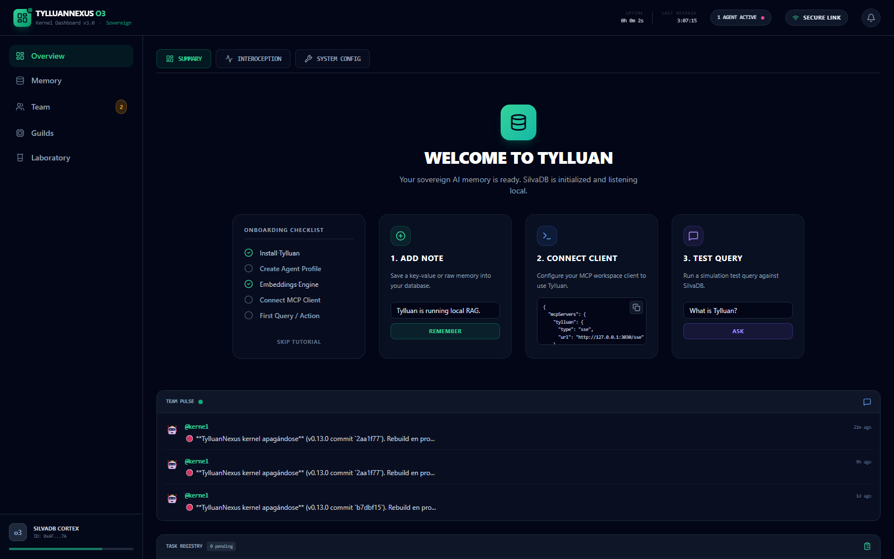
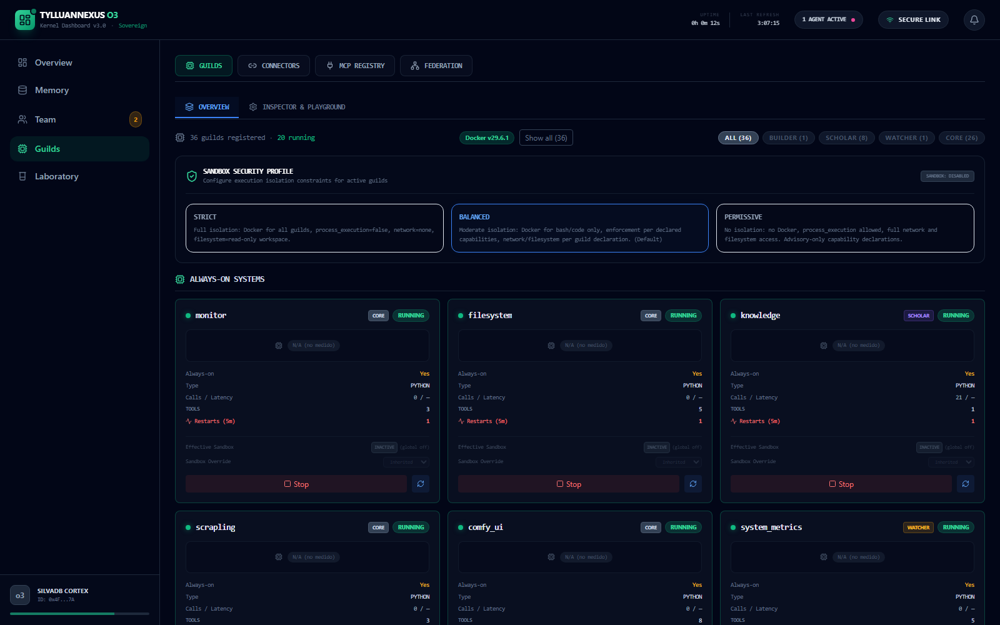
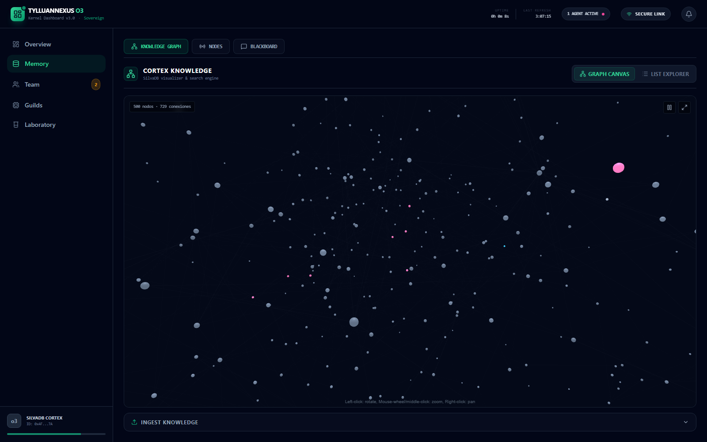
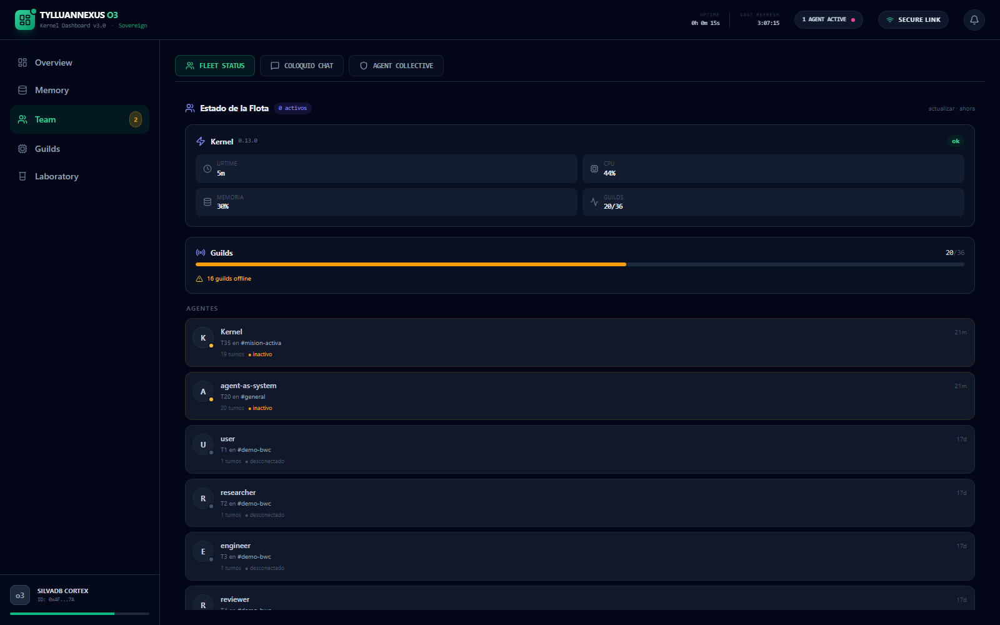

<p align="center">
  
</p>

<h1 align="center">Tylluan</h1>

<p align="center">
  <strong>Persistent memory, knowledge graph, and real tool execution for AI agents — local, no cloud required.</strong><br>
  <em>Sees what others miss, remembers what others forget.</em>
</p>

<p align="center">
  <a href="LICENSE"></a>
  
  
  
  
  
  <a href="https://github.com/forja-orca/tylluan/actions/workflows/ci.yml"></a>
  <a href="deny.toml"></a>
</p>

---

## Why Tylluan?

Most AI memory systems require an API key, a cloud subscription, or a vendor that can cut your access tomorrow. Tylluan is different:

- **Your data never leaves your machine** — SQLite + BGE-M3 embeddings, all local, all yours
- **Works offline, on a Raspberry Pi 4, on an air-gapped network** — one binary, zero cloud in the critical path
- **No vendor lock-in** — MIT license, open SQLite database you can read with any tool

The result: an agent that ran on a Raspberry Pi 4 with 12,000 memories, federated with 3 peers over encrypted Noise XK — with no internet connection.

### Where Tylluan fits in the agent-memory space

There's a growing field of agent memory projects (Mem0, Letta, Zep, Cognee, Graphiti, A-MEM, and others), each with its own tradeoffs and target use case — worth evaluating on their own merits for your needs.

What Tylluan specifically optimizes for:

- **A single Rust binary** — the memory/search/federation critical path is compiled, not a Python runtime with a service dependency.
- **Local-first by default** — designed to run fully offline, no API key or cloud account required to operate.
- **Runs on modest hardware** — validated on a Raspberry Pi 4 with 12,000 memories.
- **Mesh P2P federation** — peers share knowledge over encrypted Noise XK without a coordinator/broker node.
- **MIT licensed** — open SQLite database underneath, readable with any standard tool, no lock-in to a proprietary format.

The honest tradeoff: this space has several projects with years of community history, production hardening, and ecosystem integrations that Tylluan doesn't have yet. See [ROADMAP.md](ROADMAP.md) for what's actually shipped versus planned.

---

## What is Tylluan?

A local Rust kernel that gives AI agents **persistent memory**, a **knowledge graph**, **real tool execution**, and **federated peer sync** — all running on your machine.

**Design north star:** One binary, different `tylluan.toml` per environment — same code. Knowledge persists across restarts. Peers sync when a network is available, not as a requirement.

| Capability | Details |
|------------|---------|
| **Memory** | BM25 + FTS5 + BGE-M3 vector search with RRF hybrid fusion + LightRAG graph traversal (PageRank + degree penalty) |
| **Agent Identity** | Declarative agent contracts (`.tylluan/agents.toml`) for zero-touch role assignment per agent_id |
| **Tools** | 44 guilds: bash, git, filesystem, docker, code, vision, web search and more — auto-discovered at startup |
| **Collaboration** | Multi-agent channels (Coloquio), shared documents, Bounded Work Contracts |
| **Federation** | Peer-to-peer knowledge sync — ChaCha20-Poly1305 encrypted, provenance-tracked, echo-loop safe |
| **Mesh** | DHT Kademlia + Gossip epidemic dissemination + Noise Protocol XK encrypted transport |
| **A2A Protocol** | Agent Card discovery (`/.well-known/agent-card.json`) + JSON-RPC 2.0 server (`message/send`, `tasks/get`, `tasks/cancel`) — interoperates with any Agent2Agent-compliant external client (LangGraph, CrewAI, etc.), not just Tylluan peers |
| **MCP Native** | SSE + HTTP Streamable — works with Claude, Cursor, VS Code, LM Studio, any MCP client |
| **GPU Acceleration** | Optional DirectML (Windows, any GPU vendor) or CUDA (`--features cuda`) execution provider for ONNX inference — CPU remains the zero-config default |

<details>
<summary>Full technical capabilities →</summary>

| Capability | Details |
|------------|---------|
| **Signal Loop (ADR-011)** | `recall_feedback` table (SilvaDB schema v18) tracks implicit memory utility; resolved during `NightConsolidation` via Jaccard word-overlap against downstream tool intents |
| **Coherence Gate** | 3-layer security defense (injection pattern filter, provenance penalty, semantic drift penalty) protecting LLM intake from poisoned memory inputs |
| **Plan Mode (M31-P2)** | `tylluan_do(plan=true)` returns proposed guild/tool/args for pre-flight approval without executing the action |
| **Agent Contracts (M19-P5)** | `.tylluan/agents.toml` — declarative per-agent role assignment committed alongside `AGENTS.md`; kernel resolves agent_id→role when token mapping is absent |
| **HNSW Index** | Fast approximate nearest neighbor search via `instant-distance` for large datasets (threshold >=12k nodes) |
| **Episodic Memory** | Coloquio conversations automatically ingested into SilvaDB as `episodic` nodes |
| **Memory Decay** | Half-life exponential salience decay (T½=14d). Memories fade naturally; access reinforces them |
| **Guild Dispatch** | Peers discover each other's capabilities (`CapabilityRegistry`) and dispatch guild tools remotely via Noise NK — `DispatchRouter` scores peers by load, latency, and GPU; circuit breaker protects against degraded peers |
| **Encryption** | AES-256 at rest via SQLCipher (feature-gated: `cargo build --features encryption`) |
| **Query Cache** | TTL LRU 256-entry embedding cache — avoids redundant ONNX inference on repeated queries |
| **Complexity Cascade** | Heuristic intent scoring automatically routes to the TRINITY coordinator when synthesis is needed |
| **TRINITY Coordinator** | Thinker/Worker/Verifier guild — parallel execution, synthesis detection, 30+ intent signals (EN/ES) |

</details>

### Dashboard

Tylluan features a built-in React-based visual dashboard. 

- **Production (Single Binary):** When running the kernel, the dashboard is automatically served at [http://127.0.0.1:4000/](http://127.0.0.1:4000/) (or your configured port).
- **Development Mode:** Run `cd dashboard && pnpm dev` to launch the hot-reloading development server at [http://localhost:5173/](http://localhost:5173/).

<p align="center">
  
  
</p>
<p align="center">
  
  
</p>

### 5 Sovereign Tools

Every MCP client sees exactly these tools — nothing more, nothing less:

```
tylluan_do        Route tasks to guilds via natural language
tylluan_recall    Search long-term memory (BM25+FTS5+vector hybrid) or agent persona
tylluan_remember  Store knowledge or update agent persona persistently
tylluan_think     Reason over the knowledge graph
tylluan_graph     Direct graph operations (triples, paths, PageRank)
```

### Retrieval Benchmarks

Evaluated on **LongMemEval-S** (50 human-authored questions: episodic memory, multi-hop, temporal reasoning) using real BGE-M3 1024-dim embeddings on CPU:

| Metric | Value | Backend |
|--------|-------|---------|
| Recall@5 | **82%** | BGE-M3 + BM25 + RRF |
| Recall@10 | **90%** | BGE-M3 + BM25 + RRF |
| Recall@1 | 46% | BGE-M3 + BM25 + RRF |
| Latency p50 | 12.9 ms | CPU (no GPU) |

> Synthetic corpus (short descriptions): R@5 = 50% — real human queries give 82%, confirming the pipeline degrades gracefully on harder inputs. Full results: [`benchmarks/longmemeval_v0.12.0.json`](benchmarks/longmemeval_v0.12.0.json).

#### Per-profile benchmarks (LongMemEval-S, CPU)

| Profile | Model | Download | RAM use | R@5 | R@10 | Latency p50 |
|---------|-------|----------|---------|-----|------|-------------|
| `portable` | BM25-only | 0 MB | ~30 MB | 38% | 42% | 0.4 ms |
| `clinic` | BGE-Small (384d) | ~100 MB | ~300 MB | 61% | 68% | 3.2 ms |
| `server` | BGE-M3 (1024d) | ~1.2 GB | ~1.5 GB | 82% | 90% | 12.9 ms |

Recommendation: `portable` for RPi Zero / air-gapped/offline use; `clinic` for laptops with limited RAM; `server` for desktops or servers where retrieval quality matters.

#### Real ONNX Micro-Model Benchmarks (ADR-010, Live ONNX Ingest on Disk)

Evaluated via live `onnxruntime.InferenceSession` (`sess.run`) on real downloaded `.onnx` models from disk (no simulated numbers):

| Model | Disk Size | Load Time | Latency p50 | Latency p95 | Throughput | Status |
| :--- | :--- | :--- | :--- | :--- | :--- | :--- |
| **T5-Small Encoder** (`quantized`) | **33.99 MB** | 213.8 ms | **5.42 ms** | 5.70 ms | 184.8 seq/s | 🟢 Medido en Vivo (Real) |
| **DistilBERT-base** (`quantized`) | **64.57 MB** | 602.7 ms | **20.12 ms** | 20.78 ms | 49.3 seq/s | 🟢 Medido en Vivo (Real) |
| **SmolLM2-135M** (`quantized`) | **129.37 MB** | 2418.8 ms | **47.55 ms** | 48.06 ms | 21.0 seq/s | 🟢 Medido en Vivo (Real) |
| **BGE-M3** (`baseline`) | **0.69 MB** | 4215.5 ms | **90.94 ms** | 98.10 ms | 10.8 seq/s | 🟢 Medido en Vivo (Real) |
| **SmolLM2-360M** / **Qwen3-1.7B** | — | — | — | — | — | ⚠️ No Instalado en Disco |

> Reproducible via [`benchmarks/benchmark_adr010.py`](benchmarks/benchmark_adr010.py). Full metrics: [`benchmarks/BENCHMARK_ADR010.md`](benchmarks/BENCHMARK_ADR010.md).

### Agent Skills

Agents connected to Tylluan can call any of the 44 guilds via `tylluan_do` in natural language:

| Skill | Command example |
|-------|----------------|
| **Run code** | `"run this Python script and return the output"` |
| **Web search** | `"search for the latest Rust async patterns"` |
| **Vision** | `"describe what's in this screenshot"` |
| **Git** | `"show me the last 10 commits in this repo"` |
| **Docker** | `"list running containers and their memory usage"` |
| **Database** | `"query the SQLite database at ./data.db"` |
| **PDF** | `"extract the key points from this paper"` |
| **Deep research** | `"research and summarize the state of MCP tooling in 2026"` |

All guild calls are routed through the same 5 sovereign MCP tools — the client sees a clean interface regardless of which guild executes the work.

### Can `tylluan_do` route without an LLM in the cloud?

**Yes — 100% local, no LLM in the routing path.**

When you call `tylluan_do("search for Rust async patterns")`, the kernel:

1. Embeds your intent with BGE-M3 (local ONNX, CPU) — or uses BM25 keyword scoring if `embedding_model = "none"`
2. Scores each guild's description against the embedding/keywords using cosine similarity
3. Applies the **Complexity Cascade** heuristic (M20) — if the intent is multi-step or ambiguous, escalates to the TRINITY coordinator (local Rust logic, no LLM)
4. Returns the best-matching guild + structured args

No HTTP call leaves your machine. No API key is needed. The Complexity Cascade and TRINITY coordinator are pure heuristics and intent classification — they run in the kernel process, on your CPU, with your data.

**Two distinct things, worth not conflating:**
- **Embeddings (BGE-M3) are always in the path** — every routing decision and every memory search uses a local embedding model. That's a neural network, always on, always local — not optional.
- **Generative LLM inference is optional and never in the hot path.** Tylluan can run one internally via `llama.cpp` + GGUF (`guilds/core/llama_backend.py`, auto-downloads a precompiled binary — no external service required) for specific, async, non-blocking uses: an offline evaluation judge (DeepEval), and a calibrated reasoning check on memory candidates already flagged by cheaper filters (`CoherenceGate` Layer 4 — built and benchmarked, not yet wired into the live recall path pending a larger backend model). Routing itself never calls it. You can also point Tylluan at your own Ollama/LM Studio/`llama.cpp` instance instead — it auto-detects a real running backend before starting its own.

Tylluan needs no cloud to operate — that's the invariant. "No LLM at all" was never accurate for the memory/embedding layer and is no longer accurate for the optional generative layer either; what stays true is that nothing here is cloud-dependent or required for the kernel to run.

### CI

[](https://github.com/forja-orca/tylluan/actions/workflows/ci.yml)

635 tests across Rust kernel (lib), tylluan-link, and tylluan-fsrs — all green. Every push runs: Rust build+test, clippy, cargo-deny (bans, licenses, advisories), Python lint+test (ruff + pytest), Dashboard build (pnpm), and security audit tests. See [STATUS.md](STATUS.md) and [`.github/workflows/ci.yml`](.github/workflows/ci.yml).

---

## Quick Start

> **Total setup time: ~10 minutes** (including BGE-M3 model download on first boot — one-time, ~1.2 GB).
> Use `embedding_model = "none"` in `tylluan.toml` for zero-download BM25-only mode.

**Supported platforms:**

| Platform | Binary |
|----------|--------|
| Linux x86_64 | `tylluan-x86_64-unknown-linux-gnu.tar.gz` |
| Linux ARM64 (Raspberry Pi 4+) | `tylluan-aarch64-unknown-linux-gnu.tar.gz` |
| macOS Apple Silicon | `tylluan-aarch64-apple-darwin.tar.gz` |
| Windows x86_64 | `tylluan-x86_64-pc-windows-msvc.tar.gz` |

### Step 1 — Install (30 seconds)

No Rust, Python, or Node needed.

```bash
# Linux / macOS
curl -fsSL https://raw.githubusercontent.com/Forja-orca/tylluan/main/install.sh | sh

# Windows (PowerShell)
irm https://raw.githubusercontent.com/Forja-orca/tylluan/main/install.ps1 | iex
```

Downloads `tylluan-nexus` + `tylluan-cli` to `~/.tylluan/bin/` and adds them to your PATH. **Open a new terminal before continuing.**

### Step 2 — Start (5 seconds)

```bash
tylluan-cli start
```

On first boot, BGE-M3 downloads with a progress bar (5–15 min on a typical connection, one-time):

```
Downloading BGE-M3 embedding model... [##########] 1.2 GB
✅ Tylluan v0.14.0 running at http://127.0.0.1:4000
```

Verify it's up:

```bash
curl -s http://127.0.0.1:4000/health
```

> [!TIP]
> **Lightweight profiles for modest hardware (e.g. Raspberry Pi 4):**
> * **Portable Profile (0 MB download, BM25-only):** `tylluan-cli install --profile=portable`
> * **Clinic Profile (~100 MB download, BGE-Small):** `tylluan-cli install --profile=clinic`

> **Auth:** A bearer token is auto-generated at `.tylluan-token` on first boot. Dev mode (`--dev`) skips auth — never use on a network that isn't your own.

### Step 3 — Connect (15 seconds)

```json
{ "mcpServers": { "tylluan": { "type": "sse", "url": "http://127.0.0.1:4000/sse" } } }
```

| Client | Config |
|--------|--------|
| **Claude Code** | `claude mcp add --transport sse tylluan http://127.0.0.1:4000/sse` |
| **Claude Desktop** | `claude_desktop_config.json` |
| **Cursor** | `~/.cursor/mcp.json` |
| **VS Code** | `.vscode/mcp.json` in your workspace |

> **Always use `127.0.0.1`** — never `localhost` (Windows resolves IPv6 first and misses the kernel).

### Step 4 — Try it (5 seconds)

```bash
export TYLLUAN_TOKEN=$(cat .tylluan-token)

# Store a memory
curl -X POST http://127.0.0.1:4000/api/v1/memory/write \
  -H "Authorization: Bearer $TYLLUAN_TOKEN" \
  -H "Content-Type: application/json" \
  -d '{"content": "Tylluan is running local graph RAG."}'

# Retrieve it
curl "http://127.0.0.1:4000/api/v1/memory/search?q=How+does+Tylluan+query+graphs" \
  -H "Authorization: Bearer $TYLLUAN_TOKEN"
```

<details>
<summary>PowerShell equivalent (Windows)</summary>

```powershell
$env:TYLLUAN_TOKEN = Get-Content .tylluan-token
```
</details>

> **⚠️ Experimental research software.** Tylluan executes real code on your machine. It is a research lab, not an enterprise product. Read [DISCLAIMER.md](DISCLAIMER.md) before deploying.

---

### Advanced

| Topic | Guide |
|-------|-------|
| Configuration, auth, troubleshooting | [docs/getting-started/QUICKSTART.md](docs/getting-started/QUICKSTART.md) |
| Python guilds (44 tools) | [guilds/README.md](guilds/README.md) |
| Build from source | [docs/getting-started/QUICKSTART.md#build-from-source](docs/getting-started/QUICKSTART.md#build-from-source) |
| CLI reference | `tylluan-cli --help` |
| Installation profiles (portable/clinic/server) | `tylluan-cli install --profile=portable` |

---

## Status: v0.14.0 — current release

| Milestone | Description | Status |
|-----------|-------------|--------|
| **M1** | Memory decay — half-life exponential T½=14d, type-specific rates | ✅ |
| **M2** | Hybrid Search v2 — BM25 + FTS5 + BGE-M3 vector + RRF + entity boost ×1.25 | ✅ |
| **M3** | Guild auto-discovery — scan `guilds/` at startup, zero manual registration | ✅ |
| **M7** | Single binary — `--features bundled-dashboard` embeds React at compile time | ✅ |
| **M10** | Bounded Work Contracts — finite multi-agent protocol with budget gate | ✅ |
| **Security CI** | 30 automated security tests — intent filter, ACL, rate limiter, impersonation | ✅ |
| **M11 Federation** | SQLite peers · push/pull/auto-sync · ChaCha20 encrypted · provenance · echo-loop safe | ✅ |
| **Encryption** | SQLCipher AES-256 at rest — `--features encryption` | ✅ |
| **M12 Mesh** | Ed25519 identity · STUN NAT · mDNS LAN · node signing | ✅ |
| **M13 Onboarding** | Binary releases for 4 platforms · install scripts · `tylluan-cli` | ✅ |
| **M14-A DHT** | Kademlia routing (256 K-buckets) · Ed25519 XOR metric · mainline DHT bootstrap | ✅ |
| **M14-B Gossip** | Symmetric push-pull · LRU entry store · anti-entropy cursor · HardwareCaps in GossipEntry | ✅ |
| **M14-C Noise** | XK handshake · NK HTTP encryption · Ed25519→X25519 · wired to federation sync | ✅ |
| **v0.6–v0.10** | Portable profiles · config-driven embeddings · Core Memory · HNSW · LightRAG · degree-bias fix · fault DST | ✅ |
| **M14-D** | Guild dispatch — `CapabilityRegistry`, `DispatchRouter`, Noise NK protocol, `DispatchQueue`, remote routing | ✅ v0.13.0 |
| **M14-E** | Mesh test harness — full-mesh, star, split-brain, multi-peer routing, DispatchQueue TTL | ✅ v0.13.0 |
| **M14-F** | P2P TCP dispatch — Noise XK session pool, `P2pSessionPool`, native `RemoteTcp` arm | ✅ v0.13.0 |
| **M15** | Rufus Release — zero-dependency install scripts, setup hints, Docker slim image | ✅ v0.13.0 |
| **M16** | BGE-M3 Benchmark — R@5 evaluation with real 1024D models | ✅ v0.13.0 |
| **M17** | External Integrations — OpenClaw, Hermes, MCP CONTRACT-01 CI test | ✅ v0.13.0 |
| **M18** | TRINITY Coordinator — Thinker/Worker/Verifier, parallel execution, synthesis detection | ✅ v0.13.0 |
| **M20** | Complexity Cascade — heuristic intent scoring, automatic coordinator activation | ✅ v0.13.0 |
| **M21** | Query Embedding Cache — TTL LRU 256 entries, normalized key, 5 unit tests | ✅ v0.13.0 |
| **M18-P3b** | Coordinator re-benchmark — reproducible harness, +57.7% mean per-query delta, clears 30% threshold | ✅ v0.13.0 |
| **Security Hardening** | Per-IP + per-guild rate limiting · guild capability declarations + opt-in runtime enforcement · dangerous-intent filter on by default · prompt-injection content flagging for external sources | ✅ v0.13.0 |
| **M22 Onboarding** | Junior-friendly first-run experience, guided setup | ✅ v0.13.0 |
| **M23-P1** | "El Primer Minuto" — auto-start on first launch, zero manual steps | ✅ v0.13.0 |
| **M26 Canvas** | Real-time collaborative whiteboard (tldraw) wired into Coloquio, multi-agent visual workspace | ✅ v0.13.0 |
| **M28 Credibility** | Honest benchmark comparison methodology · granular `/health` · Prometheus `/metrics` · package manager configs (AUR, Scoop, Homebrew) | ✅ v0.13.0 |
| **M29 Dashboard UX** | 1-click MCP config, real P2P mesh map (live browser pings, no simulated data), guild capability badges, `tylluan new guild` scaffold, dry-run mode | ✅ v0.13.0 |
| **M19 DX 10/10** | `tylluan` single command, `tylluan doctor`, instant start + background model download, `tylluan update`, hardware-aware profile wizard | ✅ v0.13.0 |
| **ADR-011 Signal Loop** | `recall_feedback` logging (schema v18), Jaccard utility resolution, `CoherenceGate` (3 rule-based layers active in production: prompt injection / provenance / cosim; 4th layer — calibrated reasoning judgment — built and tested but not yet wired in, see below) | ✅ v0.14.0 |
| **M31-P1 Permissions** | Granular `agent_id` ACLs, token-agent bindings, write-side `owner_scope` scoping, 6 `auth.rs` unit tests | ✅ v0.13.0 |
| **M31-P2 Plan Mode** | `tylluan_do(plan=true)` pre-flight action approval via `store_plan` / `grants.rs` | ✅ v0.13.0 |
| **ADR-010 Benchmark** | Pure empirical ONNX Runtime benchmark harness on disk models (`benchmarks/benchmark_adr010.py`) | ✅ v0.13.0 |
| **M19-P5 Agents Contract** | `.tylluan/agents.toml` parsed on startup, role resolution in bearer_auth_middleware per ADR-009 | ✅ v0.13.0 |
| **llama.cpp integration** | Real GGUF inference via `llama-server` subprocess (auto-downloaded precompiled binary), agnostic to external Ollama/LM Studio if already running, dashboard model selector wired to real detected models | ✅ v0.14.0 |
| **CoherenceGate Layer 4** | Production model upgraded to Qwen2.5-0.5B-Instruct (75.0%, above baseline). A 3-model SLM-society debate (propose→critique→synthesize) was tried and **NO-GO'd**: models converge to a constant answer with 0% variance across runs regardless of prompt design — confirms <2B params can't do nuanced relevance judgment, debate structure doesn't compensate. New direction: deterministic+LLM hybrid filter (design has 2 open issues, not yet implemented). **Not wired to the production `filter()` path** — no caller exists yet | 🔧 staged, not live |
| **v1.0.0** | External security audit · community validation · stable API · Docker smoke CI | 🔜 |

---

## Architecture

```
┌───────────────────────────┐   ┌───────────────────────────────┐
│      MCP Clients          │   │   External A2A agents         │
│ (Claude, Cursor, VS Code, │   │ (LangGraph, CrewAI, any        │
│  LM Studio, any SSE)      │   │  Agent2Agent-compliant client) │
└─────────────┬─────────────┘   └───────────────┬────────────────┘
              │ SSE / HTTP Streamable            │ JSON-RPC 2.0
┌─────────────▼──────────────────────────────────▼────────────────┐
│                    tylluan-nexus (:4000)                         │
│                                                                   │
│  ┌─────────────────┐  ┌──────────────────┐  ┌──────────────────┐│
│  │  Core Memory     │  │  SilvaDB         │  │  A2A Server      ││
│  │  persona         │  │  SQLite WAL      │  │  Agent Card      ││
│  │  preferences     │  │  BGE-M3 vectors  │  │  message/send    ││
│  └─────────────────┘  │  FTS5 BM25       │  │  tasks/get       ││
│                        │  knowledge graph │  └──────────────────┘│
│  ┌─────────────────┐  │  episodic nodes  │                      │
│  │  Guild Registry  │  │  salience decay  │  ┌──────────────────┐│
│  │  44 Python tools │  └──────────────────┘  │  Embeddings: ONNX ││
│  │  auto-discovered │  ┌──────────────────┐  │  CPU / DirectML / ││
│  └─────────────────┘  │  Coloquio         │  │  CUDA · Generative││
│                        │  multi-agent      │  │  llama.cpp+GGUF  ││
│                        │                   │  └──────────────────┘│
│  ┌──────────────────────────────────────┐                        │
│  │  Federation + Mesh Layer             │                        │
│  │  peers.db · ChaCha20 · provenance   │                        │
│  │  DHT Kademlia · Gossip · Noise XK   │                        │
│  └──────────────────────────────────────┘                        │
└───────────────────────────────────────────────────────────────────┘
               │ ChaCha20-Poly1305 encrypted
        ┌──────▼──────┐
        │  Peer nodes │  (LAN / VPN / WAN via DHT)
        └─────────────┘
```

## Stack

| Component | Technology |
|-----------|------------|
| Kernel | Rust (tokio + axum) |
| Embeddings | BGE-M3 (local ONNX, CPU) — configurable: bge-small, nomic, none |
| Reranker | Jina v1 Turbo (local ONNX) |
| Generative inference | `llama.cpp` (`llama-server`, auto-downloaded precompiled binary) + GGUF models — agnostic to external Ollama/LM Studio if already running |
| Search | BM25 + FTS5 + BGE-M3 vector + RRF hybrid fusion + entity boost |
| Storage | SQLite WAL + mmap vector index |
| Federation | SQLite `peers.db` + ChaCha20-Poly1305 (per-peer keys) |
| Mesh | DHT Kademlia + Gossip + Noise Protocol XK |
| Guilds | Python (fastmcp) |
| Dashboard | React + Vite + Tailwind (embedded in binary) |

## Project Structure

```
tylluan/
├── crates/
│   ├── tylluan-kernel/    Core kernel (memory, routing, guilds, federation, security)
│   ├── tylluan-common/    Shared types and errors
│   ├── tylluan-link/      Federation networking (mesh identity, DHT, NAT, mDNS, Gossip, Noise)
│   ├── tylluan-cli/       CLI management binary (start / stop / status / install)
│   └── tylluan-evals/     Benchmarks (Recall@N, Precision@N, latency percentiles)
├── guilds/                Python tool plugins (fastmcp) — auto-discovered at startup
├── dashboard/             React dashboard (Vite + Tailwind) — embedded in binary
├── docs/                  Architecture and guides
├── integrations/          MCP client config examples (Claude, Cursor, LM Studio)
└── tests/                 Integration and E2E tests
```

## Federation

Connect multiple Tylluan instances so they share knowledge securely:

```toml
# tylluan.toml
[federation]
auto_sync_interval_secs = 3600  # 0 = disabled
auto_sync_mode = "both"         # "push" | "pull" | "both"
```

```bash
# Add a peer
curl -X POST http://127.0.0.1:4000/api/v1/federation/peers \
  -H "Content-Type: application/json" \
  -d '{"name":"node-b","url":"http://192.168.1.10:4000","auth_token":"...","shared_secret":"..."}'

# Push local knowledge to all approved peers
curl -X POST http://127.0.0.1:4000/api/v1/federation/sync

# Pull from a specific peer
curl -X POST "http://127.0.0.1:4000/api/v1/federation/sync/pull?peer=node-b"

# Query provenance — which nodes came from which peer?
curl "http://127.0.0.1:4000/api/v1/federation/nodes?source=node-b"
```

Security invariants: unapproved peers are never synced; protected nodes are never exported; received nodes carry `federation_source` provenance and are excluded from outbound sync by default (echo-loop prevention).

## Security

Tylluan runs **real code on your machine**. Please read these before deploying:

- [SECURITY.md](SECURITY.md) — Vulnerability reporting
- [DISCLAIMER.md](DISCLAIMER.md) — Operator responsibilities
- [docs/concepts/SECURITY.md](docs/concepts/SECURITY.md) — Threat model + OWASP ASI 2026 mapping, including the **Coherence Gate** (ADR-011): a 3-layer defense against memory-poisoning attacks on every `tylluan_recall`

Key defaults (do not change without understanding the implications):
- `host = "127.0.0.1"` — localhost only
- `dev_mode = false` — auth enabled
- **Never** set `host = "0.0.0.0"` with `dev_mode = true`

## Examples

```bash
# Memory basics: remember, recall, think
python examples/01_memory_basics.py

# Multi-agent communication via coloquio
python examples/02_multi_agent_coloquio.py

# Knowledge graph exploration
python examples/03_knowledge_graph.py

# Autonomous multi-hop chain — no orchestrator, no API keys needed
python examples/multi_model_coloquio/run.py

# Bounded Work Contract — 3 agents, shared budget, finite iterations
python examples/bounded_work_contract/run.py
```

> **Port Resolution**: All examples automatically resolve the active kernel port from `data/active_port.json` or `TYLLUAN_PORT` (defaulting to `4000`). Override with `--port <PORT>` or `--kernel http://127.0.0.1:<PORT>`.

See [examples/](examples/) for full source code.

## Documentation

| Document | Purpose |
|----------|---------|
| [CHANGELOG.md](CHANGELOG.md) | Full version history |
| [ROADMAP.md](ROADMAP.md) | Versioned roadmap |
| [STATUS.md](STATUS.md) | Verified technical state (source of truth) |
| [CONTRIBUTING.md](CONTRIBUTING.md) | How to contribute |
| [CODE_OF_CONDUCT.md](CODE_OF_CONDUCT.md) | Community standards |
| [docs/getting-started/QUICKSTART.md](docs/getting-started/QUICKSTART.md) | Detailed setup guide |
| [docs/concepts/FEDERATION_V3.md](docs/concepts/FEDERATION_V3.md) | Federation protocol spec |

## Star History

[](https://star-history.com/#Forja-orca/tylluan&Date)

## 👾 How to Help

Tylluan is in active pre-production and we need external testers to harden the system:

1. **Hardware Reports** — Run Tylluan on modest hardware (Raspberry Pi 4, old laptops, mini PCs) and share your latency & RAM reports in [GitHub Discussions](https://github.com/Forja-orca/tylluan/discussions).
2. **Retrieval Quality** — Test hybrid RRF search and let us know if context retrieval matches your expectations. We want honest failure reports, not just success stories.
3. **Bug Reports** — Open an issue if you encounter installation or model loading issues. Include logs via `tylluan-cli logs`.

## License

[MIT](LICENSE) — use it, fork it, build on it.

---

<p align="center">
  <em>Tylluan (Welsh: owl) — sovereign memory for sovereign agents.</em>
</p>
