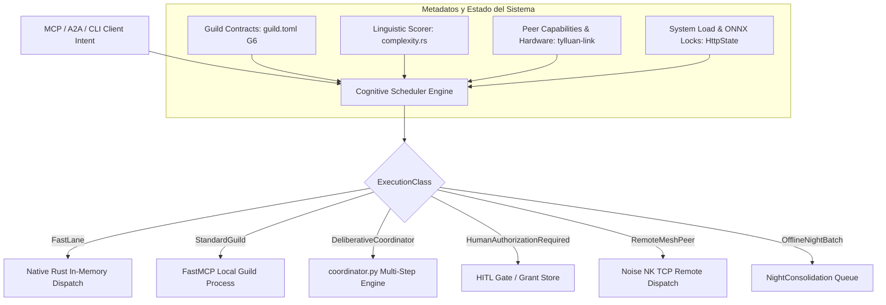

# Cognitive Scheduler: Diseño de Orquestación Multidimensional

**Estado:** PROPUESTA TÉCNICA FORMALIZADA (2026-09-08) — Diseñado por Antigravity (Fase P0 #3 del Roadmap v1.0, ver `EXTERNAL_AUDIT_2026-09-08_v1_roadmap.md`).  
**Fecha:** 2026-09-08  
**Origen:** Auditoría técnica v1.0 (Sección 11 & Fase P0 #3), cruzado con la implementación real de `crates/tylluan-kernel/src/router/complexity.rs`, `catalog.rs` y el contrato G6 `DESIGN_guild_identity_gate.md`.

---

## 1. Problema Real y Diagnóstico del Estado Actual

En la arquitectura actual de Tylluan, la toma de decisiones sobre *cómo*, *dónde* y *con qué garantías* ejecutar una tarea recae exclusivamente en un modelo unidimensional de complejidad sintáctica (`complexity.rs`):

```text
                                  ESTADO ACTUAL (Unidimensional)
                                  
   Intent ──► complexity.rs ──► Score [0.0 - 1.0] ──► Cascade:
                (Sintaxis/MLP)                          ├── < 0.4: Direct Guild
                                                        ├── 0.4..0.6: Reactive Fallback
                                                        └── >= 0.6: Proactive Coordinator
```

### Limitaciones Críticas del Modelo Unidimensional:
1. **Acoplamiento Falso entre Complejidad y Riesgo:**  
   Un comando destructivo simple como *"borra la base de datos de producción y limpia el disco"* tiene un `score_complexity < 0.2` (pocas palabras, sin conectores multi-paso), por lo que se despacha como `Direct Guild` sin ninguna salvaguarda reforzada. A la inversa, una consulta de sólo lectura rica en detalles ("*dame un resumen comparando A y B en los últimos 3 meses*") puntúa `score >= 0.7` y se envía al coordinador pesado.
2. **Ceguera de Presupuesto de Latencia (*Latency Budget*):**  
   No existe noción de cuánto tiempo está dispuesto a esperar el cliente (MCP en vivo vs job de background vs A2A). Un recall interactivo puede disparar una cascada lenta sin advertencia.
3. **Ceguera de Recursos de Cómputo (*Compute Budget / Contention*):**  
   No evalúa si el modelo ONNX está saturado, si la GPU está ocupada por un entrenamiento local (ej. Unsloth), o si un peer de la federación (`tylluan-link`) dispone de aceleración hardware dedicada.
4. **Ausencia de Clases de Ejecución Deterministas:**  
   El routing pasa directo de *"un guild Python"* a *"orquestación multi-agente en coordinator.py"*, sin niveles intermedios como ejecución rápida determinista en Rust (`FAST`), delegación P2P con Noise NK (`REMOTE`), o solicitud obligatoria de autorización humana (`HITL`).

---

## 2. Principios Invariantes del Cognitive Scheduler

1. **Determinismo Estricto en el Despacho:**  
   El Scheduler no invoca un LLM generativo para decidir cómo agendar (lo cual introduciría latencia estocástica y fallos de parseo en el camino crítico). Es una máquina de decisión determinista en Rust, ejecutada en $<0.5\text{ ms}$ con cero asignaciones pesadas.
2. **Precedencia del Riesgo sobre la Complejidad:**  
   El nivel de riesgo y la irreversibilidad de una acción **siempre dominan** sobre la simplicidad sintáctica. Ninguna acción con `RiskLevel::Destructive` puede despacharse por la vía rápida sin pasar por las políticas de autorización correspondientes.
3. **Conciencia de Presupuesto y Degradación Elegante:**  
   Si el cómputo local está saturado o el `LatencyBudget` es estricto, el Scheduler degrada a la mejor aproximación determinista o delega a un nodo peer capacitado, en lugar de bloquear el hilo de ejecución.
4. **Desacoplamiento Total del Hot Path:**  
   Las tareas que no tienen un plazo de respuesta interactivo se agendan como `ExecutionClass::OfflineNightBatch` para ser procesadas en `NightConsolidation`.

---

## 3. Dimensiones Ortogonales del Scheduler

El Cognitive Scheduler evalúa 5 dimensiones independientes antes de emitir una decisión de despacho:

```text
┌──────────────────────────────────────────────────────────────────────────────────┐
│                            DIMENSIONES DE EVALUACIÓN                             │
├───────────────────────┬──────────────────────────────────────────────────────────┤
│ 1. Complejidad        │ Sintáctica (conectores, pasos) + Semántica (entidades)   │
│ 2. Perfil de Riesgo   │ Read / IdempotentWrite / Destructive / Exfiltration      │
│ 3. Latency Budget     │ Presupuesto temporal estricto (Instant / Interactive /   │
│                       │ Batch / Deferred)                                        │
│ 4. Compute Budget     │ Estado de CPU/GPU, contención de mutex ONNX, memoria     │
│ 5. Reversibilidad     │ Rollback-capable (vía undo_last_action) vs Irreversible │
└───────────────────────┴──────────────────────────────────────────────────────────┘
```

### A. Complejidad Cognitiva (`ComplexityScore`)
Refina la base existente de `complexity.rs`:
* **Baja ($<0.35$):** Operación unitaria atómica (un solo verbo, un solo target).
* **Media ($0.35 - 0.65$):** Tarea compuesta con dependencias lineales (ej. "busca X y luego filtra por Y").
* **Alta ($>0.65$):** Tarea no lineal, síntesis abierta, razonamiento dialéctico o planificación multi-herramienta.

### B. Perfil de Riesgo (`RiskProfile`)
Derivado del contrato del guild (`guild.toml` de G6) y de los verbos de intención:
* **`Tier 0 (Safe Read)`:** Búsqueda en memoria, status, lectura de archivos permitidos, métricas.
* **`Tier 1 (Idempotent Write)`:** Guardar memoria temporal, crear logs, actualizar checkpoints locales reversibles.
* **`Tier 2 (State Mutation / External Side-Effect)`:** Modificar archivos de código, compilar, llamadas de red salientes (HTTP/Scrapling).
* **`Tier 3 (Critical / Destructive / Security-Sensitive)`:** Borrado de archivos, ejecución de comandos bash sin sandbox, modificación de claves/tokens, mutación de políticas de acceso.

### C. Presupuesto de Latencia (`LatencyBudget`)
* **`Instant (<50ms)`:** Respuestas de health, lecturas en caché, operaciones deterministas en memoria.
* **`Interactive (<500ms)`:** Consultas de retrieval híbrido (`tylluan_recall`), enrutamiento rápido de guilds.
* **`Standard (<5000ms)`:** Inferencia con modelos locales pequeños (BGE-M3, SLMs ligeros), tool execution compleja.
* **`Deferred / Nightly (Sin límite)`:** Consolidación de memoria, optimización FSRS, análisis de fallos en background.

---

## 4. Estructuras de Datos Canónicas en Rust

Ubicación proyectada: `crates/tylluan-kernel/src/router/scheduler/types.rs`

```rust
use std::time::Duration;
use serde::{Deserialize, Serialize};

/// Perfil de riesgo de la acción propuesta
#[derive(Debug, Clone, Copy, PartialEq, Eq, PartialOrd, Ord, Serialize, Deserialize)]
pub enum RiskTier {
    /// Lectura segura sin mutación de estado
    SafeRead = 0,
    /// Escritura idempotente y reversible
    IdempotentWrite = 1,
    /// Mutación de estado o efecto secundario de red
    StateMutation = 2,
    /// Acción potencialmente destructiva, privilege escalation o borrado
    CriticalDestructive = 3,
}

/// Presupuesto temporal asignado a la tarea
#[derive(Debug, Clone, Copy, PartialEq, Eq, Serialize, Deserialize)]
pub enum LatencyClass {
    /// Menor a 50ms (solo estructuras en memoria / cache)
    Instant,
    /// Menor a 500ms (path interactivo MCP)
    Interactive,
    /// Menor a 5s (ejecución estándar de herramientas)
    Standard,
    /// Desacoplado / Asíncrono (sin deadline estricto)
    Deferred,
}

/// Clase de ejecución decidida por el Scheduler
#[derive(Debug, Clone, PartialEq, Eq, Serialize, Deserialize)]
pub enum ExecutionClass {
    /// Despacho local determinista ultrarrápido (<20ms, sin subprocesos)
    FastLane { target_handler: String },
    /// Despacho estándar a un Guild FastMCP local
    StandardGuild { guild_id: String, tool_name: String },
    /// Orquestación multi-paso deliberativa vía coordinator.py
    DeliberativeCoordinator { plan_mode: bool },
    /// Requiere aprobación humana explícita antes de ejecutar (HITL Grant)
    HumanAuthorizationRequired { reason: String, suggested_action: String },
    /// Delegación remota P2P vía Noise NK a un peer de la federación
    RemoteMeshPeer { peer_id: String, capability: String },
    /// Tarea encolada para el ciclo de consolidación nocturna
    OfflineNightBatch { job_type: String },
}

/// Contexto integral de planificación recibido por el Scheduler
#[derive(Debug, Clone, Serialize, Deserialize)]
pub struct TaskContext {
    pub intent: String,
    pub caller_agent_id: String,
    pub latency_class: LatencyClass,
    pub allow_remote_mesh: bool,
    pub requires_rollback: bool,
}

/// Veredicto completo emitido por el Cognitive Scheduler
#[derive(Debug, Clone, Serialize, Deserialize)]
pub struct SchedulingDecision {
    pub execution_class: ExecutionClass,
    pub complexity_score: f64,
    pub risk_tier: RiskTier,
    pub latency_budget: Duration,
    pub explanation: String,
}
```

---

## 5. Matriz de Decisión del Scheduler

El algoritmo evalúa la tupla `(ComplexityScore, RiskTier, LatencyClass, SystemLoad)` mediante una tabla de verdad determinista:

```
┌─────────────────┬───────────┬──────────────┬──────────────────────────────┬────────────────────────┐
│ Complexity      │ Risk Tier │ Latency      │ Execution Class              │ Justificación Técnica  │
├─────────────────┼───────────┼──────────────┼──────────────────────────────┼────────────────────────┤
│ Baja (<0.35)    │ SafeRead  │ Instant/Int. │ FastLane                     │ Despacho directo <20ms │
│ Baja (<0.35)    │ Mutation  │ Interactive  │ StandardGuild (Auto-Commit)  │ Ejecución unitaria     │
│ Cualquiera      │ Critical  │ Cualquiera   │ HumanAuthorizationRequired   │ Riesgo domina siempre  │
│ Media (0.35-0.6)│ SafeRead  │ Standard     │ StandardGuild (w/ Fallback)  │ Intento directo + c-brk│
│ Alta (>0.65)    │ Safe/Mut. │ Standard     │ DeliberativeCoordinator      │ Requiere planificación │
│ Alta (>0.65)    │ SafeRead  │ Interactive  │ FastLane / Direct Fallback   │ Latency budget acota   │
│ Cualquiera      │ Safe/Mut. │ Deferred     │ OfflineNightBatch            │ Batch background       │
│ Saturado Local  │ SafeRead  │ Standard     │ RemoteMeshPeer (Noise NK)    │ Offloading federado    │
└─────────────────┴───────────┴──────────────┴──────────────────────────────┴────────────────────────┘
```

---

## 6. Integración con los Subsistemas de Tylluan



### A. Conexión con `G6 (Capability Contracts)`
El Scheduler lee directamente el manifiesto canónico `guild.toml` definido en G6. Si un guild declara `execution.risk = "destructive"` o carece de soporte para `rollback`, el Scheduler intercepta automáticamente la petición y escala el `RiskTier` a `CriticalDestructive`.

### B. Conexión con `tylluan_do` y Ejecución Transaccional
En `crates/tylluan-kernel/src/transport/server/handler_do.rs`:
1. El handler consulta `scheduler.evaluate(&task_context)`.
2. Si el Scheduler retorna `HumanAuthorizationRequired`, `handler_do` genera un `ActionID` pendiente en el `GrantStore` y devuelve el plan propuesto con status `PENDING_APPROVAL` sin mutar el sistema.
3. Si retorna `FastLane` o `StandardGuild`, ejecuta bajo el contrato transaccional `PLAN -> EXECUTE -> VERIFY -> COMMIT`.

### C. Conexión con `tylluan-link` (Federación P2P)
Si el `ComputeBudget` local está agotado (ej. CPU al 100% o contención de memoria) y la tarea es `SafeRead` con `allow_remote_mesh = true`, el Scheduler consulta el `CapabilityRegistry` de `tylluan-link` y despacha la tarea a un peer remoto vía `execute_remote_tcp()` con cifrado Noise NK de forma completamente transparente.

---

## 7. Plan de Implementación y Criterios de Aceptación (DoD)

### Fase 1: Extracción y Tipado Modular (Semana 1)
*   Crear módulo `crates/tylluan-kernel/src/router/scheduler/`.
*   Migrar y refactorizar las heurísticas de `complexity.rs` hacia el evaluador multidimensional.
*   Implementar `RiskAnalyzer` basado en patrones de verbos y metadatos de guild.
*   *DoD:* 100% de tests unitarios verificando la matriz de decisión (30+ tests).

### Fase 2: Cableado con `handler_do` y `catalog.rs` (Semana 2)
*   Integrar `SchedulingDecision` en el pipeline de ejecución de `handler_do.rs`.
*   Sustituir el bloque cascade hardcodeado de `complexity.rs` por la llamada al nuevo Scheduler.
*   Integrar la validación con los contratos de G6.
*   *DoD:* `cargo check -p tylluan-kernel` y tests E2E de routing pasando en verde.

### Fase 3: Benchmarks de Latencia y Overhead (Semana 3)
*   Añadir benchmark de micro-latencia en `crates/tylluan-evals`: el Scheduler debe resolver cualquier decisión en $<0.5\text{ ms}$ en CPU de referencia.
*   Verificar que ninguna acción destructiva pueda bypassar el `RiskTier::CriticalDestructive`.
*   *DoD:* CI en verde, documentación sincronizada en `STATUS.md` y visualizador.

---

## 8. Conclusión

El **Cognitive Scheduler** transforma a Tylluan de un enrutador sintáctico reactivo a un **sistema operativo cognitivo consciente de riesgo, presupuesto y hardware**, resolviendo la deuda de contención y sentando las bases deterministas para Tylluan v1.0.
