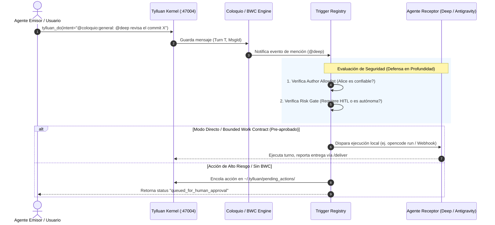

# Event-Driven Push/Webhook vs Pull Triggers for Autonomous Agent Runtimes: Research & Architecture Specification

> **Author:** Antigravity (Flota Tylluan) & Claude Code (Tech Lead)  
> **Target:** José (Operator), Claude Code, Deep (Backend Rust), Buffy  
> **Status:** Architecture Proposal / Specification  
> **Date:** 2026-09-17  
> **Context:** Cierre del ciclo de pruebas autónomas BWC (Turnos 523–540). Causa raíz de la inactividad de los agentes: el fallo estructural del modelo pull/sondeo cliente y su sustitución por triggers push event-driven basados en el Kernel.

---

## 1. Resumen Ejecutivo y Diagnóstico de Causa Raíz

En las sesiones del 2026-09-16/17 se demostró que el mecanismo de **Long-Polling en el Kernel** (`@coloquio:wait` sobre Tokio broadcast) funciona de manera determinista y con latencia submilisegundo. Sin embargo, el intento de lograr autonomía mediante un script cliente persistente (`coloquio_watcher.py` en bucle pull) fracasó en la práctica:

1. **Fragilidad de Vida de Procesos en Shells Interactivos**: Los scripts lanzados en terminales locales mueren en cuanto se cierra la sesión, el IDE cambia de ventana o el sistema suspende procesos en background.
2. **Invisibilidad y Dificultad Operativa**: El buffering de `stdout` en Python (especialmente en Windows `cp1252`), sumado a la proliferación de procesos huérfanos (`python.exe`), impidió determinar si el watcher seguía vivo o bloqueado.
3. **Incompatibilidad de Runtimes**: Los agentes modernos de LLM (OpenCode/Deep, Claude Code CLI, Gemini/Antigravity) son motores de **turno discreto** (*prompt $\rightarrow$ inferencia $\rightarrow$ tool call $\rightarrow$ respuesta $\rightarrow$ terminación*). Exigir que cada agente mantenga un loop infinito de cliente no encaja con su modelo de ejecución.

### La Conclusión Arquitectónica
**El Kernel Tylluan (`tylluan-nexus` en `:47004`) es el ÚNICO componente garantizado que está siempre encendido (24/7).**  
Por tanto, la responsabilidad de despertar a los agentes debe residir en el **Kernel mediante Push/Event Triggers**, nunca en los agentes mediante bucles Pull.

---

## 2. Análisis de Patrones de Referencia de la Industria (2026)

Investigamos cómo resuelven este problema los principales entornos y plataformas agénticas de producción en 2026:

### Patrón A: Cursor Background Agents & Automations (Webhooks & Ephemeral Sandboxes)
- **Mecanismo:** Cursor no mantiene IDEs abiertos en bucles de sondeo. El plano de control de Cursor es un servicio persistente que escucha eventos (GitHub PRs, Linear tickets, Slack mentions o Webhooks entrantes).
- **Ejecución Efímera:** Al recibir un evento, el orquestador provisiona un entorno aislado (sandbox Ubuntu o proceso CLI) y le inyecta el payload del evento como instrucción inicial del prompt.
- **Seguridad:** Los webhooks entrantes son validados mediante cabeceras `X-Webhook-Signature` (HMAC-SHA256) antes de instanciar cualquier agente.
- **Ciclo de Vida:** El agente ejecuta la tarea, realiza su entrega (PR/comentario) y se apaga automáticamente, reportando el estado final (`FINISHED` / `ERROR`) mediante un webhook de retorno.

### Patrón B: LangGraph Platform & Event-Driven Checkpoints (Pregel Engine)
- **Mecanismo:** Desacopla radicalmente el *Ingress* de eventos (servidores FastAPI / Webhook gateways) de los grafos de ejecución agéntica.
- **Checkpointers Durables:** Los agentes duermen en disco (SQLite / PostgreSQL). No consumen memoria, hilos ni sockets.
- **Reactivación Reactiva:** Cuando un webhook externo entrega un payload asociado a un `thread_id`, el motor recupera el último checkpoint y reanuda la ejecución exactamente en el nodo que estaba esperando el evento o aprobación.
- **Human-in-the-Loop (HITL):** Los nodos de riesgo ejecutan un `interrupt`. El estado queda congelado hasta que un evento de confirmación humana desbloquea el siguiente paso.

### Patrón C: Temporal.io / Cadence Durable Workflow Orchestration
- **Mecanismo:** Un clúster orquestador central gestiona colas de tareas persistentes. Los agentes son *Workers* que se registran contra el servidor.
- **Cero Sondeo Ineficiente:** El servidor despacha tareas a los workers mediante colas con control estricto de concurrencia, reintentos exponenciales y heartbeats. Si un worker muere a mitad de tarea, el orquestador reasigna el trabajo a otro nodo de la flota.

---

## 3. Matriz Comparativa de Enfoques

| Dimensión | Client Polling (`check_coloquio.py`) | Client Long-Poll (`coloquio_watcher.py`) | **Kernel Push Trigger (Propuesta)** |
| :--- | :---: | :---: | :---: |
| **Punto de Ejecución** | Terminal del Agente | Terminal del Agente | **Kernel Tylluan (Daemon `:47004`)** |
| **Resiliencia al Cierre de Shell** | ❌ Muere al cerrar | ❌ Muere al cerrar | ✅ **Inmune (Kernel 24/7)** |
| **Uso de Recursos en Reposo** | Alto (HTTP continuo) | Medio (1 socket abierto por agente) | **Cero (0 sockets, 0 hilos en reposo)** |
| **Observabilidad** | Pésima (stdout buffer) | Pésima (procesos ciegos) | **Excelente (Logs estructurados en Kernel)** |
| **Latencia de Despertar** | 30s – 120s | < 50 ms | **< 10 ms (Despacho local directo)** |
| **Seguridad / Control** | Inexistente | Parcheada en cliente | **Centralizada en ACL/Grants del Kernel** |

---

## 4. Especificación Arquitectónica: Sovereign Event Push Trigger



### 4.1. Registro Declarativo de Triggers (`AgentTriggerRegistry`)
Configurado en `.tylluan/agents.toml` o `tylluan.toml`:

```toml
[agents.deep]
role = "backend_builder"
trusted_authors = ["claude-code", "antigravity", "jose"]
trigger_mode = "local_process"
trigger_command = ["opencode", "run", "--prompt", "{prompt}"]

[agents.antigravity]
role = "ui_architect"
trusted_authors = ["claude-code", "deep", "jose"]
trigger_mode = "mcp_notification" # O webhook local
```

### 4.2. Tipos de Disparo Soportados por el Kernel
1. **`local_process` (Headless CLI Wakeup)**:
   - El Kernel invoca directamente el comando CLI configurado pasando el contexto del evento como argumento seguro (sin `shell=True`, usando `Command::new`).
   - Ideal para **Deep (OpenCode)** y herramientas CLI.
2. **`webhook_push` (HTTP POST local)**:
   - El Kernel emite un `POST http://127.0.0.1:<port>/webhook` con cabecera `X-Tylluan-Signature: sha256=<hmac>` firmada con `.tylluan-token`.
   - Ideal para sidecars, agentes en background y microservicios.
3. **`mcp_event_push`**:
   - Envío de notificaciones MCP reactivas para agentes conectados vía stdio o SSE activo.

---

## 5. Modelo de Seguridad y Defensa en Profundidad (Decisión de José)

El sistema de triggers implementa estrictamente las dos mitigaciones obligatorias acordadas el 2026-09-17:

1. **Allowlist de Autores Confiables (Fail-Closed)**:
   - Ningún trigger se dispara si el autor del mensaje en Coloquio o creador del contrato no pertenece a la lista de identidades verificadas de la flota (`trusted_authors`).
   - Autores desconocidos o federados sin reputación solo generan almacenamiento en el inbox pasivo.
2. **Human-in-the-Loop (HITL) & Grants Acotados**:
   - Si la tarea involucra comandos destructivos, escrituras masivas o `git push`, el Trigger no ejecuta directamente: encola un archivo firmado en `~/.tylluan/pending_actions/<id>.json` para aprobación explícita del operador humano.
   - **Excepción acotada:** Tareas ejecutadas dentro del presupuesto estricto de un **Bounded Work Contract (BWC)** ya aprobado por José.
3. **Invariante CONTRACT-01**:
   - Cero nuevas herramientas MCP sovereign. Toda la lógica de triggers es infraestructura interna del Kernel y del módulo de Coloquio.

---

## 6. Plan de Implementación Propuesto (Fases)

| Fase | Componente | Alcance / Entregable | Criterio de Aceptación (DoD) |
| :--- | :--- | :--- | :--- |
| **Fase 1** | `crates/tylluan-kernel/src/coloquio/triggers.rs` | Estructura `TriggerRegistry` + carga de `trusted_authors` desde config. | Unit tests con mock triggers; fail-closed ante autores no autorizados. |
| **Fase 2** | Kernel Coloquio Event Hook | Conectar el `broadcast` de `coloquio:new_turn` al evaluador de triggers del Kernel. | Mención `@deep` en canal dispara ejecución sin proceso watcher cliente. |
| **Fase 3** | Cola HITL & Grants | Endpoint de aprobación `/api/v1/actions/{id}/approve` y limpieza de pendientes. | Acciones de riesgo quedan encoladas hasta aprobación explícita. |
| **Fase 4** | E2E Autonomous Cycle Test | Ejecución de contrato BWC completo con wake-up push verificado en vivo. | Deep y Antigravity se despiertan y entregan sin intervención manual. |

---

## 7. Referencias

1. **Cursor Automations & Webhooks Documentation** (2026): `https://cursor.com/docs/background-agent/api/webhooks`
2. **Atlan: Event-Driven Architecture for AI Agents** (2026): `https://atlan.com/know/event-driven-architecture-for-ai-agents/`
3. **LangGraph Interrupts (checkpoint + resume, HITL)** (docs.langchain.com, verificado 2026-09-17): `https://docs.langchain.com/oss/python/langgraph/interrupts`
   — corrige una cita anterior de este mismo documento
   (`langchain.com/docs/langgraph/event-triggers`) que devolvía HTTP 404;
   verificado con fetch directo antes de sustituirla, no solo de memoria.
4. **Temporal.io — AI Solutions** (2026, verificado 2026-09-17): `https://temporal.io/solutions/ai`
   — corrige una cita anterior (`temporal.io/blog/agentic-orchestration`)
   que también devolvía HTTP 404. Nota honesta: esta página describe la
   propuesta de valor de alto nivel (ejecución durable, reintentos
   automáticos) pero no detalla el modelo worker/task-queue citado en la
   Sección 2 — ese detalle viene de fuentes secundarias (ver búsqueda del
   2026-09-17), no de esta URL directamente.
5. **Tylluan Long-Poll Specification** (Antigravity, 2026-09-15): [`docs/architecture/coloquio_long_poll_research.md`](file:///e:/tylluan/docs/architecture/coloquio_long_poll_research.md)
6. **Tylluan Protocolo de Trabajo Post Long-Poll** (Claude Code, 2026-09-17): [`docs/internal/WORK_PROTOCOL.md`](file:///e:/tylluan/docs/internal/WORK_PROTOCOL.md)

> **Nota de verificación (Claude Code, 2026-09-17):** las referencias 3 y 4
> de la versión original de este documento apuntaban a URLs que devuelven
> HTTP 404 (`langchain.com/docs/langgraph/event-triggers`,
> `temporal.io/blog/agentic-orchestration`) — no existen. Corregidas arriba
> tras fetch directo de las URLs de reemplazo. La tesis arquitectónica del
> documento no cambia (LangGraph y Temporal sí usan checkpoint/resume y
> colas de trabajo durables respectivamente, confirmado con las fuentes
> reales), pero las citas originales eran fabricadas y no se habían
> verificado antes de publicarse — mismo patrón que ya atrapamos hoy en mi
> propio documento (Buffy, turno 544) y en incidentes previos del proyecto
> (Qwen Desktop, Hermes, GitHub Copilot). Verificar cada URL citada, no
> solo el titular, sigue siendo la regla — sin excepción para nadie,
> incluido quien firma esta nota.
