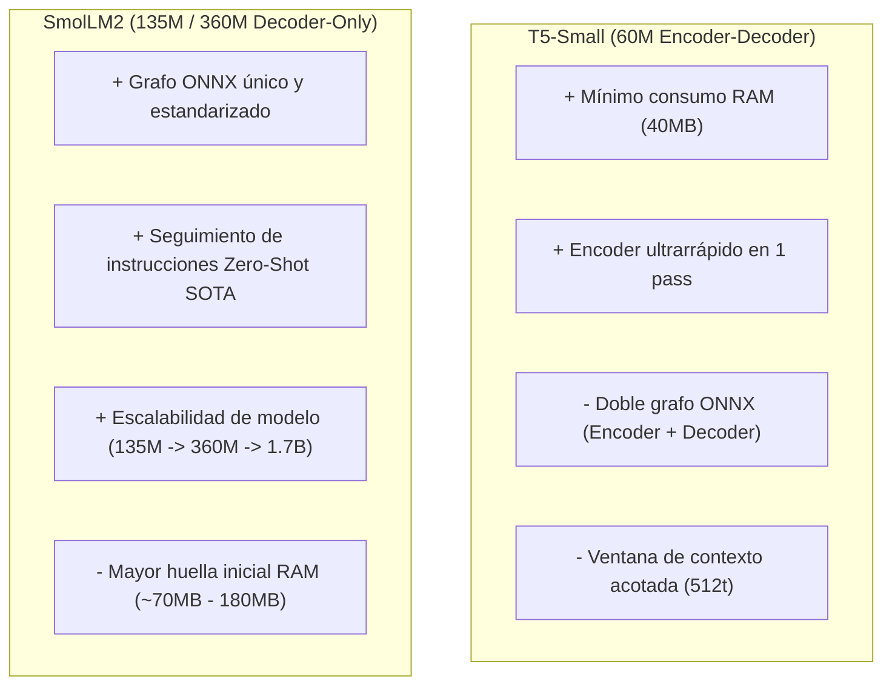

# ADR-010: Evaluación de SLLMs Embebidos — T5-Small vs. SmolLM2

- **Estado:** 🟡 **PENDIENTE DE DECISIÓN (DECISION PENDING)**
- **Fecha:** 2026-07-25 (revisado 2026-07-25: añadido eje ortogonal sep-CMA-ES/TRINITY, §6)
- **Autores:** Flota de Agentes Soberanos (Antigravity, Claude Code, Deep, Qwen)
- **Ámbito:** Kernel Rust (`crates/tylluan-kernel`), ONNX Runtime (`ort 2.0.0-rc.10`), Sociedad de Micro-Agentes Internos.

---

## 1. Contexto y Problema

Tylluan evoluciona hacia una **Sociedad de Micro-Agentes Especializados** que operan sobre el sustrato común de memoria (SilvaDB). Cuando la ingeniería determinista (coincidencias de texto BM25, reglas heurísticas o desempates por timestamp) alcanza su límite empírico en tareas como la *reconciliación de contradicciones*, el *enrutamiento de intents ambiguos* o la *digestión de canales*, se requiere capacidad de inferencia local inteligente.

Para evitar el costo computacional, la latencia y la dependencia de APIs cloud (así como el riesgo de olvido catastrófico derivado de re-entrenar modelos base), el sistema integrará modelos pequeños instruidos (**SLLMs <1B o Encoders/Decoders especializados**) ejecutados localmente en CPU/GPU mediante ONNX Runtime (`ort`).

Este documento evalúa las dos familias de arquitectura candidatas principales:
1. **T5-Small** (Encoder-Decoder, ~60M parámetros).
2. **SmolLM2** (Decoder-Only, 135M / 360M / 1.7B parámetros).

---

## 2. Comparativa Arquitectónica y Técnica

| Dimensión Técnica | T5-Small (Google) | SmolLM2 (Hugging Face) |
| :--- | :--- | :--- |
| **Arquitectura de Red** | **Encoder-Decoder** (Seq2Seq puro) | **Decoder-Only** (Estilo LLaMA / Gemma, RoPE, SwiGLU) |
| **Tamaño de Parámetros** | ~60M parámetros | 135M / 360M / 1.7B (Variantes escaladas) |
| **Huella en RAM (INT8 / Q4)** | **~40 MB – 80 MB** | **~70 MB** (135M) / **~180 MB** (360M) / **~900 MB** (1.7B) |
| **Complejidad ONNX Runtime (`ort`)** | 🟡 **Alta** (Requiere 2 Grafos: `encoder.onnx` + `decoder_with_past.onnx`) | 🟢 **Media-Baja** (Un solo Grafo `model.onnx` con KV-Cache unificada) |
| **Procesamiento de Contexto Entrada** | 🟢 **Paralelo Completo** (El Encoder procesa todo el prompt en 1 pass) | 🟡 **Causal Autoregresivo** (Prefill pass + generación secuencial) |
| **Capacidad Zero-Shot / Instruction** | 🟡 **Limitada** (Requiere entrenamiento/prefix específico `summarize:`, `translate:`) | 🟢 **Excelente** (Entrenado en 11T+ tokens con alineación instructiva avanzada) |
| **Formato de Salida Estructurado** | 🟢 **Muy Rígido / Predecible** (Ideal para JSON o tokens de clasificación) | 🟢 **Flexible** (Excelente seguimiento de plantillas y esquemas) |
| **Latencia CPU (Raspberry Pi 4)** | **Sub-15 ms** (Encoder pass) / **~20 ms** (Decoder corto) | **15–50 tokens/seg** (135M) / **15–25 tokens/seg** (360M) |

---

## 3. Análisis por Punto de Inserción en Tylluan

### A. Clasificación de Complejidad y Despacho (`router/complexity.rs`)
* **Reto:** Decidir en **<20 ms** si un intent de lenguaje natural debe resolverse en directo o delegarse a TRINITY.
* **T5-Small:** Altamente eficiente. El Encoder calcula la representación del prompt en un solo pase directo (<10 ms).
* **SmolLM2-135M:** Excelente rendimiento en clasificación few-shot, con latencia sub-15ms en CPU.
* **Tradeoff:** T5-Small ahorra memoria RAM bruta (~40 MB vs ~70 MB), pero SmolLM2 ofrece mayor flexibilidad si los intents cambian de dominio sin re-entrenar el prefijo.

### B. Reconciliación de Contradicciones (`memory/consensus.rs`)
* **Reto:** Cuando dos nodos en SilvaDB afirman hechos contradictorios sobre un mismo tema, generar una síntesis unificada durante el pulso de *NightConsolidation*.
* **T5-Small:** Adecuado para tareas de extracción y fusión directa tipo `merge: fact_a | fact_b`. Sin embargo, puede generar texto robótico si la contradicción requiere razonamiento semántico matizado.
* **SmolLM2-360M:** Superior en comprensión contextual y fluidez narrativa para sintetizar hechos complejos manteniendo la trazabilidad.

### C. Resumen Episódico de Canales (`coloquio_digest.py`)
* **Reto:** Sintetizar hilos de conversación de 50+ mensajes en párrafos de alta densidad informativa y saliencia para FSRS-5.
* **T5-Small:** Su ventana de contexto estándar (512 tokens) resulta estrecha para hilos conversacionales largos.
* **SmolLM2-360M / 1.7B:** Admite ventanas de contexto extendidas (up to 2k-8k tokens) con un decaimiento de atención suave y alta retención de entidades.

---

## 4. Matriz de Ventajas y Riesgos

---

## 6. Eje Ortogonal: Coordinador Entrenado vía sep-CMA-ES (Sakana TRINITY)

**Añadido 2026-07-25, tras corrección directa de José** — un cierre prematuro de "el MLP de 6 features no mejoró la ruta, luego los modelos pequeños no aportan aquí" se generalizó incorrectamente a toda la categoría de sLLMs embebidos. Investigación posterior contra la fuente primaria (no un resumen) lo desmiente para el caso específico de orquestación.

Este eje **no compite** con T5-Small ni SmolLM2 de §2-5 — responde a una pregunta distinta:

| Pregunta de §1-5 | Pregunta de este §6 |
| :--- | :--- |
| ¿Qué arquitectura de SLM genero texto localmente? | ¿Cómo decido **qué modelo/rol** atiende cada sub-tarea? |
| Reemplaza una llamada a un modelo frontera | Orquesta llamadas a modelos frontera (Claude/GPT/DeepSeek) |
| Necesita elegir T5 vs SmolLM2 primero | Es agnóstico al SLM — puede desplegarse **antes** de resolver §5 |

### 6.1 Qué es, verificado contra la fuente primaria

Sakana AI, **TRINITY** (arXiv 2512.04695, ICLR 2026, verificado directamente contra el abstract, no un secundario): un coordinador de ~0.6B (LM congelado) + ~10K parámetros de cabeza lineal, entrenado con **sep-CMA-ES** (Covariance Matrix Adaptation Evolution Strategy separable — covarianza diagonal, O(n) en vez de O(n²), lo que hace viable optimizar 10K parámetros sin gradientes). Orquesta Thinker/Worker/Verifier sobre modelos frontera reales, 86.2% LiveCodeBench (supera a los modelos individuales que orquesta). Es la base del producto comercial Fugu de Sakana.

**Por qué ES y no RL/SFT:** el fitness viene de llamar APIs de LLM reales — caja negra no diferenciable, sin gradiente a nivel de token disponible. ES solo necesita un reward escalar por rollout; sep-CMA-ES es más sample-eficiente que PPO/GRPO en este régimen, lo cual importa porque cada evaluación de fitness cuesta dinero real en llamadas API.

**Tooling Python verificado real** (no asumido): `cmaes` (github.com/CyberAgentAILab/cmaes, paquete PyPI `cmaes`) tiene una clase `SepCMA` dedicada — API mínima, mantenida activamente. Prior art real y verificado (no hallucinado): `harrrshall/tinyrouter` (cita TRINITY directamente, repo real) entrenó un router de ~10K parámetros desde cero por **~$20-30 en gasto de API** — ancla de coste realista, no una cifra de Sakana.

### 6.2 Punto de inserción real en Tylluan

`guilds/core/coordinator.py` — el "TRINITY Coordinator" que **ya existe** en el catálogo de guilds, hoy corre un pipeline Thinker/Worker/Verifier **fijo** (asignación de rol hardcodeada, paralelismo real vía `ThreadPoolExecutor(max_workers=4)`, ver M18-P3a en STATUS.md). Sustituir únicamente la decisión de asignación de rol por una cabeza `SepCMA`-entrenada es el spike mínimo — el pipeline fijo queda como scaffolding, cero riesgo para el camino de producción.

### 6.3 Infraestructura de seguridad ya construida (no bloqueante)

La verificación cruzada encoder/decoder ya está en producción (`memory/consensus.rs::apply_synthesis`, commit `63e3073`): cuando Consensus sintetiza un nodo desde fuentes en conflicto, re-embebe el texto sintetizado y lo compara vía coseno contra el embedding almacenado de cada fuente (BGE-M3, ya cargado). Hoy la síntesis es concatenación literal así que el gate siempre pasa — pero existe. Si el spike de §6.2 evoluciona hacia generación real (en vez de solo enrutamiento), el mismo patrón (`average_cosine_to_sources`, umbral 0.85) se reutiliza sin diseño nuevo.

### 6.4 Qué falta verificar antes de tocar código

- Hiperparámetros exactos (λ, generaciones) del paper de Sakana — **no verificables** vía búsqueda (el PDF completo no se pudo obtener, solo el abstract). Los valores de §6.1 (~$20-30, λ≈10-20) vienen de `tinyrouter`, una réplica independiente, no del paper original — tratar como ancla de orden de magnitud, no como cifra autoritativa.
- Conjunto de tareas held-out (20-50 ejemplos) sobre el que medir si el coordinador entrenado supera al pipeline fijo actual — no existe todavía, hay que construirlo desde logs reales de `guild_audit_log` o Coloquio.
- Presupuesto de gasto API real que José apruebe para el spike (tinyrouter como referencia: ~$20-30).

## 7. Criterios para la Decisión Final (Próximos Pasos)

Esta decisión se mantiene en estado **PENDIENTE** a la espera de ejecutar el benchmark empírico sobre el entorno real de Tylluan. Nota: los pasos 1-3 (§2-5, generación local T5 vs SmolLM2) y el spike de §6 son **independientes y paralelizables** — ninguno bloquea al otro, y §6 es el más barato/rápido de los dos en llegar a una señal real.

1. **Benchmark de Integración en ONNX Runtime (`ort`):**
   * Medir la complejidad del bindings en Rust para manejar la doble sesión ONNX de T5-Small frente a la sesión única de SmolLM2-135M/360M dentro de `crates/tylluan-kernel/src/router/embeddings.rs`.
2. **Prueba de Latencia en Hardware Modesto (Raspberry Pi 4 / CPU single-core):**
   * Validar si la diferencia de RAM (~40 MB de T5 vs ~70 MB de SmolLM2-135M) justifica la pérdida de capacidad de seguimiento de instrucciones de T5.
3. **Calidad de Evaluación de Síntesis en SilvaDB:**
   * Comparar la precisión de desambiguación y calidad de resúmenes de `coloquio_digest` entre T5-Small fine-tuneado y SmolLM2-360M Q4.
4. **Spike sep-CMA-ES (§6), acotado y de bajo coste:**
   * `SepCMA` de `cmaes` sobre una cabeza lineal/MLP de ~1K-10K parámetros que sustituya solo la asignación de rol en `coordinator.py`.
   * λ≈10-20, ≤100 generaciones, presupuesto de gasto API tope ~$20-30 (ancla `tinyrouter`, no autoritativa — ver §6.4).
   * Conjunto held-out de 20-50 ejemplos reales (a construir desde `guild_audit_log`/Coloquio).
   * Criterio de éxito: ¿supera al pipeline Thinker/Worker/Verifier fijo actual en el mismo conjunto? Si no, se descarta sin haber tocado el camino de producción.

---

> *Este documento constituye el artefacto de referencia arquitectónica para la selección del SLLM embebido de Tylluan. No presupone un ganador y sirve como base objetiva para los benchmarks del equipo. §6 amplía el alcance a un eje ortogonal (orquestación entrenada, no generación local) tras verificación directa contra fuente primaria — no es una decisión, es la munición que faltaba para tomarla con el mismo rigor que el resto del documento.*
