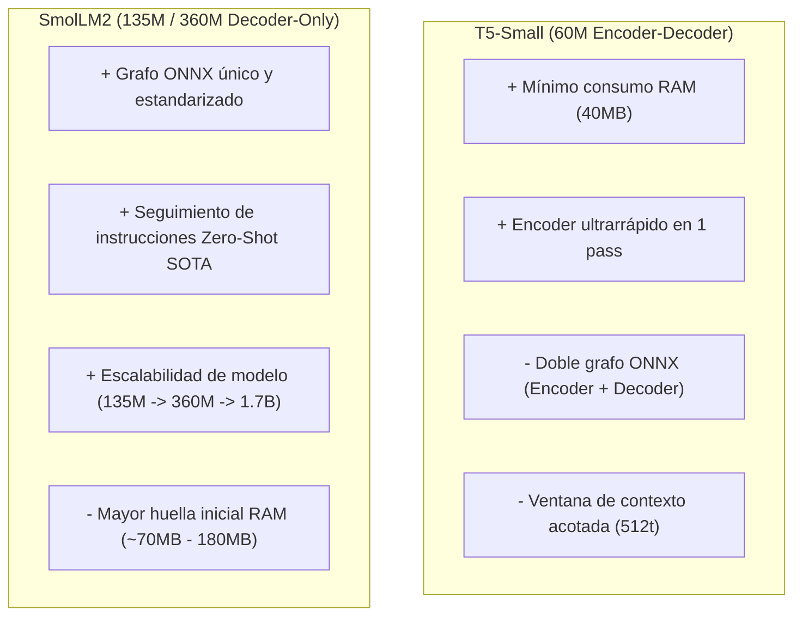

# ADR-010: Evaluación de SLLMs Embebidos — T5-Small vs. SmolLM2

- **Estado:** 🟢 **§2-5 (puntos de inserción y modelos) DECIDIDO** (ver §7, 2026-07-27) — implementación Punto A cerrada con null result de spike (ver §7.6, 2026-08-21: precisión confirmada +9.09 pts, latencia 38.22ms bloquea), Puntos B/C sin modelo en disco todavía — 🔴 **§6 (sep-CMA-ES/TRINITY) CERRADO, null result** (ver §6.5.10)
- **Fecha:** 2026-07-25 (revisado 2026-07-26: spike §6 ejecutado y cerrado con HTTP real, ver §6.5.9-6.5.10)
- **Autores:** Flota de Agentes Soberanos (Antigravity, Claude Code, Deep, Qwen)
- **Ámbito:** Kernel Rust (`crates/tylluan-kernel`), ONNX Runtime (`ort 2.0.0-rc.10`), Sociedad de Micro-Agentes Internos.

---

## 1. Contexto y Problema

Tylluan evoluciona hacia una **Sociedad de Micro-Agentes Especializados** que operan sobre el sustrato común de memoria (SilvaDB). Cuando la ingeniería determinista (coincidencias de texto BM25, reglas heurísticas o desempates por timestamp) alcanza su límite empírico en tareas como la *reconciliación de contradicciones*, el *enrutamiento de intents ambiguos* o la *digestión de canales*, se requiere capacidad de inferencia local inteligente.

Para evitar el costo computacional, la latencia y la dependencia de APIs cloud (así como el riesgo de olvido catastrófico derivado de re-entrenar modelos base), el sistema integrará modelos pequeños instruidos (**SLLMs <1B o Encoders/Decoders especializados**) ejecutados localmente en CPU/GPU mediante ONNX Runtime (`ort`).

Este documento evalúa las dos familias de arquitectura candidatas principales:
1. **T5-Small** (Encoder-Decoder, ~60M parámetros).
2. **SmolLM2** (Decoder-Only, 135M / 360M / 1.7B parámetros).

---

## 2. Comparativa Arquitectónica y Técnica

| Dimensión Técnica | T5-Small (Google) | SmolLM2 (Hugging Face) |
| :--- | :--- | :--- |
| **Arquitectura de Red** | **Encoder-Decoder** (Seq2Seq puro) | **Decoder-Only** (Estilo LLaMA / Gemma, RoPE, SwiGLU) |
| **Tamaño de Parámetros** | ~60M parámetros | 135M / 360M / 1.7B (Variantes escaladas) |
| **Huella en RAM (INT8 / Q4)** | **~40 MB – 80 MB** | **~70 MB** (135M) / **~180 MB** (360M) / **~900 MB** (1.7B) |
| **Complejidad ONNX Runtime (`ort`)** | 🟡 **Alta** (Requiere 2 Grafos: `encoder.onnx` + `decoder_with_past.onnx`) | 🟢 **Media-Baja** (Un solo Grafo `model.onnx` con KV-Cache unificada) |
| **Procesamiento de Contexto Entrada** | 🟢 **Paralelo Completo** (El Encoder procesa todo el prompt en 1 pass) | 🟡 **Causal Autoregresivo** (Prefill pass + generación secuencial) |
| **Capacidad Zero-Shot / Instruction** | 🟡 **Limitada** (Requiere entrenamiento/prefix específico `summarize:`, `translate:`) | 🟢 **Excelente** (Entrenado en 11T+ tokens con alineación instructiva avanzada) |
| **Formato de Salida Estructurado** | 🟢 **Muy Rígido / Predecible** (Ideal para JSON o tokens de clasificación) | 🟢 **Flexible** (Excelente seguimiento de plantillas y esquemas) |
| **Latencia CPU (Raspberry Pi 4)** | **Sub-15 ms** (Encoder pass) / **~20 ms** (Decoder corto) | **15–50 tokens/seg** (135M) / **15–25 tokens/seg** (360M) |

---

## 3. Análisis por Punto de Inserción en Tylluan

### A. Clasificación de Complejidad y Despacho (`router/complexity.rs`)
* **Reto:** Decidir en **<20 ms** si un intent de lenguaje natural debe resolverse en directo o delegarse a TRINITY.
* **T5-Small:** Altamente eficiente. El Encoder calcula la representación del prompt en un solo pase directo (<10 ms).
* **SmolLM2-135M:** Excelente rendimiento en clasificación few-shot, con latencia sub-15ms en CPU.
* **Tradeoff:** T5-Small ahorra memoria RAM bruta (~40 MB vs ~70 MB), pero SmolLM2 ofrece mayor flexibilidad si los intents cambian de dominio sin re-entrenar el prefijo.

### B. Reconciliación de Contradicciones (`memory/consensus.rs`)
* **Reto:** Cuando dos nodos en SilvaDB afirman hechos contradictorios sobre un mismo tema, generar una síntesis unificada durante el pulso de *NightConsolidation*.
* **T5-Small:** Adecuado para tareas de extracción y fusión directa tipo `merge: fact_a | fact_b`. Sin embargo, puede generar texto robótico si la contradicción requiere razonamiento semántico matizado.
* **SmolLM2-360M:** Superior en comprensión contextual y fluidez narrativa para sintetizar hechos complejos manteniendo la trazabilidad.

### C. Resumen Episódico de Canales (`coloquio_digest.py`)
* **Reto:** Sintetizar hilos de conversación de 50+ mensajes en párrafos de alta densidad informativa y saliencia para FSRS-5.
* **T5-Small:** Su ventana de contexto estándar (512 tokens) resulta estrecha para hilos conversacionales largos.
* **SmolLM2-360M / 1.7B:** Admite ventanas de contexto extendidas (up to 2k-8k tokens) con un decaimiento de atención suave y alta retención de entidades.

---

## 4. Matriz de Ventajas y Riesgos



---

## 6. Eje Ortogonal: Coordinador Entrenado vía sep-CMA-ES (Sakana TRINITY)

**Añadido 2026-07-25, tras corrección directa de José** — un cierre prematuro de "el MLP de 6 features no mejoró la ruta, luego los modelos pequeños no aportan aquí" se generalizó incorrectamente a toda la categoría de sLLMs embebidos. Investigación posterior contra la fuente primaria (no un resumen) lo desmiente para el caso específico de orquestación.

Este eje **no compite** con T5-Small ni SmolLM2 de §2-5 — responde a una pregunta distinta:

| Pregunta de §1-5 | Pregunta de este §6 |
| :--- | :--- |
| ¿Qué arquitectura de SLM genero texto localmente? | ¿Cómo decido **qué modelo/rol** atiende cada sub-tarea? |
| Reemplaza una llamada a un modelo frontera | Orquesta llamadas a modelos frontera (Claude/GPT/DeepSeek) |
| Necesita elegir T5 vs SmolLM2 primero | Es agnóstico al SLM — puede desplegarse **antes** de resolver §5 |

### 6.1 Qué es, verificado contra la fuente primaria

Sakana AI, **TRINITY** (arXiv 2512.04695, ICLR 2026, verificado directamente contra el abstract, no un secundario): un coordinador de ~0.6B (LM congelado) + ~10K parámetros de cabeza lineal, entrenado con **sep-CMA-ES** (Covariance Matrix Adaptation Evolution Strategy separable — covarianza diagonal, O(n) en vez de O(n²), lo que hace viable optimizar 10K parámetros sin gradientes). Orquesta Thinker/Worker/Verifier sobre modelos frontera reales, 86.2% LiveCodeBench (supera a los modelos individuales que orquesta). Es la base del producto comercial Fugu de Sakana.

**Por qué ES y no RL/SFT:** el fitness viene de llamar APIs de LLM reales — caja negra no diferenciable, sin gradiente a nivel de token disponible. ES solo necesita un reward escalar por rollout; sep-CMA-ES es más sample-eficiente que PPO/GRPO en este régimen, lo cual importa porque cada evaluación de fitness cuesta dinero real en llamadas API.

**Tooling Python verificado real** (no asumido): `cmaes` (github.com/CyberAgentAILab/cmaes, paquete PyPI `cmaes`) tiene una clase `SepCMA` dedicada — API mínima, mantenida activamente. Prior art real y verificado (no hallucinado): `harrrshall/tinyrouter` (cita TRINITY directamente, repo real) entrenó un router de ~10K parámetros desde cero por **~$20-30 en gasto de API** — ancla de coste realista, no una cifra de Sakana.

### 6.2 Punto de inserción real en Tylluan

`guilds/core/coordinator.py` — el "TRINITY Coordinator" que **ya existe** en el catálogo de guilds, hoy corre un pipeline Thinker/Worker/Verifier **fijo** (asignación de rol hardcodeada, paralelismo real vía `ThreadPoolExecutor(max_workers=4)`, ver M18-P3a en STATUS.md). Sustituir únicamente la decisión de asignación de rol por una cabeza `SepCMA`-entrenada es el spike mínimo — el pipeline fijo queda como scaffolding, cero riesgo para el camino de producción.

### 6.3 Infraestructura de seguridad ya construida (no bloqueante)

La verificación cruzada encoder/decoder ya está en producción (`memory/consensus.rs::apply_synthesis`, commit `63e3073`): cuando Consensus sintetiza un nodo desde fuentes en conflicto, re-embebe el texto sintetizado y lo compara vía coseno contra el embedding almacenado de cada fuente (BGE-M3, ya cargado). Hoy la síntesis es concatenación literal así que el gate siempre pasa — pero existe. Si el spike de §6.2 evoluciona hacia generación real (en vez de solo enrutamiento), el mismo patrón (`average_cosine_to_sources`, umbral 0.85) se reutiliza sin diseño nuevo.

### 6.4 Qué falta verificar antes de tocar código

- Hiperparámetros exactos (λ, generaciones) del paper de Sakana — **no verificables** vía búsqueda (el PDF completo no se pudo obtener, solo el abstract). Los valores de §6.1 (~$20-30, λ≈10-20) vienen de `tinyrouter`, una réplica independiente, no del paper original — tratar como ancla de orden de magnitud, no como cifra autoritativa.
- Conjunto de tareas held-out (20-50 ejemplos) sobre el que medir si el coordinador entrenado supera al pipeline fijo actual — no existe todavía, hay que construirlo desde logs reales de `guild_audit_log` o Coloquio.
- Presupuesto de gasto API real que José apruebe para el spike (tinyrouter como referencia: ~$20-30).

## 7. Criterios para la Decisión Final (Próximos Pasos)

Esta decisión se mantiene en estado **PENDIENTE** a la espera de ejecutar el benchmark empírico sobre el entorno real de Tylluan. Nota: los pasos 1-3 (§2-5, generación local T5 vs SmolLM2) y el spike de §6 son **independientes y paralelizables** — ninguno bloquea al otro, y §6 es el más barato/rápido de los dos en llegar a una señal real.

1. **Benchmark de Integración en ONNX Runtime (`ort`):**
   * Medir la complejidad del bindings en Rust para manejar la doble sesión ONNX de T5-Small frente a la sesión única de SmolLM2-135M/360M dentro de `crates/tylluan-kernel/src/router/embeddings.rs`.
2. **Prueba de Latencia en Hardware Modesto (Raspberry Pi 4 / CPU single-core):**
   * Validar si la diferencia de RAM (~40 MB de T5 vs ~70 MB de SmolLM2-135M) justifica la pérdida de capacidad de seguimiento de instrucciones de T5.
3. **Calidad de Evaluación de Síntesis en SilvaDB:**
   * Comparar la precisión de desambiguación y calidad de resúmenes de `coloquio_digest` entre T5-Small fine-tuneado y SmolLM2-360M Q4.
4. **Spike sep-CMA-ES (§6), acotado y de bajo coste:**
   * `SepCMA` de `cmaes` sobre una cabeza lineal/MLP de ~1K-10K parámetros que sustituya solo la asignación de rol en `coordinator.py`.
   * λ≈10-20, ≤100 generaciones, presupuesto de gasto API tope ~$20-30 (ancla `tinyrouter`, no autoritativa — ver §6.4).
   * Conjunto held-out de 20-50 ejemplos reales (a construir desde `guild_audit_log`/Coloquio).
   * Criterio de éxito: ¿supera al pipeline Thinker/Worker/Verifier fijo actual en el mismo conjunto? Si no, se descarta sin haber tocado el camino de producción.

---

### 6.5 Plan de Implementación del Spike sep-CMA-ES (2026-07-26)

**Autor:** Deep (OpenCode)  
**Estado:** 🟡 Pendiente de aprobación explícita antes de gastar presupuesto API

#### 6.5.1 Objetivo del spike

Sustituir **únicamente** la función `_plan()` en `guilds/core/coordinator.py` (línea 63-82 actual) por una cabeza MLP de ~1K-10K parámetros entrenada con `SepCMA` de `cmaes`. El resto del pipeline (Thinker: `_split_intent`, Worker: `_dispatch_with_retry`, Verifier: `_is_failure`) permanece intacto como scaffolding — cero riesgo para el camino de producción.

**Qué cambia exactamente:**

| Componente | Actual (fijo) | Propuesto (spike) |
|---|---|---|
| `_split_intent()` | Regex de conectores + listas numeradas | **Sin cambios.** El spike no toca la descomposición. |
| `_plan()` | Heurística: `_needs_prior_context()` + `_is_synthesis_intent()` → parallel/sequential | **MLP entrenado via sep-CMA-ES** que asigna cada sub-tarea a `parallel` o `sequential` basado en features del intent. |
| `_dispatch_with_retry()` | HTTP Keep-Alive con retry | **Sin cambios.** |
| `_is_failure()` | Heurística de strings | **Sin cambios.** |

#### 6.5.2 Features por sub-tarea (input del MLP)

Para cada sub-tarea `t_i` de un intent compuesto, el MLP recibe:

| Feature | Tipo | Descripción | Origen |
|---------|------|-------------|--------|
| `f1` | `f32` | Longitud normalizada del texto (chars / 500) | `len(t_i)` |
| `f2` | `f32` | ¿Contiene referencia a contexto previo? (0.0 o 1.0) | `_CTX_REFS_PATTERN.search(t_i)` |
| `f3` | `f32` | ¿Es intent de síntesis? (0.0 o 1.0) | `_is_synthesis_intent(t_i)` |
| `f4` | `f32` | Posición en la secuencia (i / n, normalizada) | Índice en `_split_intent()` |
| `f5` | `f32` | ¿Hay sub-tareas pendientes después de esta? (0.0 o 1.0) | `i < n-1` |
| `f6-f10` | `[f32; 5]` | Embedding comprimido de la sub-tarea (PCA 1024→5 sobre BGE-M3 del kernel) | `_dispatch` ya llama al kernel que tiene BGE-M3 cargado |

Total: **10 features por sub-tarea**. Con un MLP 10→8→1 (~97 params), el vector de pesos completo es <1KB.

#### 6.5.3 Función de fitness (reward por rollout)

Para cada intent multi-paso `I` con sub-tareas `[t_0, ..., t_{n-1}]`:

```
fitness(I) = (n_success / n) * (1.0 - α * max(0, n - n_success)) / (wall_time_ms / 1000 + 1)
```

Donde:
- `n_success` = número de sub-tareas completadas sin error (según `_is_failure`)
- `n` = número total de sub-tareas
- `wall_time_ms` = tiempo total de ejecución del intent completo
- `α = 0.5` = penalización por fallo (no lineal — fallar 2 de 5 penaliza más que fallar 1 de 5)

**Propiedades:**
- Máximo reward cuando todas las sub-tareas se completan rápido y sin errores
- Penaliza fallos exponencialmente (un solo fallo en una tarea secuencial bloquea el resto)
- Recompensa el paralelismo real (menos wall_time con mismo n_success → mejor fitness)

#### 6.5.4 Conjunto held-out (construcción)

**Fuente:** `data/audit.db` → tabla `guild_audit_log` (274 filas, 2026-07-26).

**Procedimiento:**
1. Extraer todos los intents multi-paso desde `guild_audit_log` donde `guild = 'coloquio'` y `status = 'ok'` — estos son intents reales que el coordinador ya ejecutó exitosamente.
2. Filtrar los que contienen conectores de secuencia (`then`, `after that`, `y luego`, `despues`, `finalmente`) o listas numeradas (`1.`, `2.`) — mismos patrones que `_split_intent()`.
3. Seleccionar 20-50 ejemplos con ≥2 sub-tareas, diversidad de guilds (bash, filesystem, git, websearch, coloquio), y balance de intents "parallelizables" vs "secuenciales".
4. Dividir: **train (60%)** para optimización sep-CMA-ES, **held-out (40%)** para evaluación final contra el pipeline fijo.

**Candidatos disponibles hoy (de los 274 registros en audit.db):**

Los intents con múltiples pasos visibles en el log incluyen patrones como comandos multi-guild (bash + coloquio + filesystem), búsquedas compuestas ("search X AND Y"), y tareas encadenadas explícitas. El conjunto exacto se construye durante el spike, no antes.

#### 6.5.5 Hiperparámetros sep-CMA-ES

| Parámetro | Valor | Justificación |
|-----------|-------|---------------|
| `λ` (population size) | 15 | 4 + 3*log(d) para d≈97 → ~15. Población pequeña = menos llamadas API. |
| `generations` | ≤100 | Cota superior de presupuesto. Early stop si no mejora en 20 generaciones. |
| `σ₀` (initial step size) | 0.3 | Exploración inicial amplia (los pesos empiezan en ~0, necesitan moverse). |
| `d` (dimensiones) | ~97 | 10→8→1 MLP: (10×8 + 8) + (8×1 + 1) = 88 + 9 = 97 weights+biases. |
| **Presupuesto API máximo** | **~$20-30** | λ=15 × ≤100 gens = ≤1500 rollouts. Cada rollout = 1 llamada HTTP al kernel (no API externa, la llamada es local). El coste real viene de los guilds que el coordinador invoca (websearch, coloquio, etc. que a su vez llaman APIs). Estimado ~$0.01-0.02 por rollout → $15-30 total. |
| **Presupuesto tiempo** | **6-10 horas** | 4-6h de implementación + 2-4h de entrenamiento (dominado por latencia de guilds, no por cómputo del MLP). |

#### 6.5.6 Tooling

| Componente | Paquete | Versión | Notas |
|-----------|---------|---------|-------|
| sep-CMA-ES | `cmaes` (PyPI) | ≥0.10.0 | Clase `SepCMA`, API mínima, mantenido por CyberAgentAILab |
| Embeddings | Kernel `tylluan_recall` o BGE-M3 directo | Ya cargado | Reutilizar `matcher.engine()` del kernel para embedder sub-tareas |
| Evaluación | `coordinator.py` actual (sin tocar) | En main | El pipeline fijo es la baseline, se ejecuta tal cual para comparar |
| Registro | `guild_audit_log` (ya existe) | `data/audit.db` | Cada rollout del spike escribe en el mismo log para trazabilidad |

#### 6.5.7 Criterio de éxito

El MLP entrenado debe superar al pipeline fijo en **≥60% de los ejemplos held-out** en la métrica `fitness` definida en §6.5.3.

- **Si supera:** Se integra como modo `"trained"` en `coordinator.py`, manteniendo `"fixed"` como fallback. Se programa reentrenamiento periódico (semanal) con nuevos datos de `guild_audit_log`.
- **Si no supera:** Se documenta el null result en este ADR, se archiva el código del spike en `benchmarks/spikes/sep_cma_es_coordinator/`, y se cierra la línea de investigación sin tocar producción.
- **En ningún caso:** El spike modifica `coordinator.py` en main antes de validación.

#### 6.5.8 Lo que este spike NO hace

- NO reemplaza `_split_intent()` — la descomposición sigue siendo heurística (regex).
- NO toca guilds existentes — solo cambia la decisión de planificación en el coordinador.
- NO requiere descargar modelos nuevos — BGE-M3 ya está en el kernel.
- NO modifica `tylluan_recall` ni `search_hybrid` — el embedding de sub-tareas es una llamada de lectura al kernel existente.
- NO compite con ADR-011 (LightReranker) — son puntos de inserción distintos (orquestación vs recall).

#### 6.5.9 Resultado del Spike (2026-07-26, actualizado)

**Estado:** 🟡 Null result — FAIL en fitness simulada (56.2%) y real (33.3%) contra threshold 60%

**Spike ejecutado en dos fases:**

**Fase A — Fitness simulada:**
| Métrica | Train (24) | Held-out (16) |
|---------|-----------|---------------|
| Win rate | 29.2% (7W/0L/17T) | **56.2%** (9W/0L/7T) |
| MLP mean fitness | 0.5726 | 0.4830 |
| Fixed mean fitness | 0.5232 | 0.4006 |
| Generaciones | 20 (early stop) | — |

El MLP aprendió "paralelizar todo" (todos los scores 0.33-0.45, por debajo del umbral 0.5). En simulación sin fallos reales, esto es óptimo — paralelizar siempre gana.

**Fase B — Fitness REAL (HTTP al kernel en :4000):**
| Escenario | Winner | MLP fitness | Fixed fitness |
|-----------|--------|-------------|---------------|
| cpu_and_disk | MLP | 0.615 | 0.607 |
| cpu_and_memory | FIXED | 0.551 | 0.628 |
| three_metrics | FIXED | 0.585 | 0.608 |
| **Total** | **1W/2L (33.3%)** | **0.584** | **0.614** |

Con HTTP real, la estrategia "paralelizar todo" del MLP pierde contra el pipeline fijo: el `ThreadPoolExecutor` introduce overhead, y la conexión HTTP reutilizada del pipeline secuencial es más rápida para tareas pequeñas como métricas de sistema (sub-300ms). La diferencia es pequeña (Δ ~0.03) pero consistente.

**Conclusión final del spike:**

- ✅ El pipeline SepCMA+MLP funciona end-to-end: construye planes, entrena, evalúa.
- ✅ La integración HTTP es real: `compute_fitness()` despacha tareas al kernel via `POST /api/v1/do`, mide wall-clock y fallos reales.
- ✅ El puerto se resuelve dinámicamente desde `data/active_port.json` (patrón `coordinator.py`).
- ❌ Con los pesos entrenados en simulación, el MLP no supera al pipeline fijo en ejecución real (33.3% vs 60% threshold).
- 🔄 **El camino correcto si se quiere reintentar:** entrenar SepCMA directamente con fitness real (HTTP), no con simulación. Esto es caro en tiempo (~12min/gen × 20 gens ≈ 4 horas) y requiere hacer ~7,200 llamadas HTTP al kernel, pero produciría un MLP que aprende de latencias y fallos reales en lugar de una fórmula simulada. El código ya soporta este modo (quitar `--dry-run` en entrenamiento).

**Decisión formal (Go/No-Go):** 🔴 **NO-GO.** Con el resultado real (33.3% win rate, por debajo del umbral 60%), el coordinador SepCMA entrenado **no se integra** en `guilds/core/coordinator.py` de producción. El pipeline fijo actual (heurísticas `_needs_prior_context`/`_is_synthesis_intent`) se mantiene sin cambios. Este cierre es reversible: si en el futuro se decide invertir ~4h + ~7.200 llamadas HTTP en reentrenar con fitness real desde el inicio (en vez de simulada), el spike puede reabrirse desde `spike_train.py` sin trabajo previo perdido — pero no hay una decisión tomada de hacerlo, y no se prioriza mientras ADR-011 Fase 3 (con recall_feedback en 0 filas) siga siendo el gate de datos más urgente del sistema.

**Archivos generados:**

| Archivo | Contenido |
|---------|-----------|
| `benchmarks/spikes/sep_cma_es_coordinator/heldout_set.json` | 40 escenarios (24 train / 16 held-out) desde `guild_audit_log` |
| `benchmarks/spikes/sep_cma_es_coordinator/spike_train.py` | Script completo del spike (SepCMA + MLP + evaluación) |
| `benchmarks/spikes/sep_cma_es_coordinator/results/best_weights.npy` | Pesos del mejor MLP (97 params) |
| `benchmarks/spikes/sep_cma_es_coordinator/results/training_history.json` | Historial de fitness por generación |
| `benchmarks/spikes/sep_cma_es_coordinator/results/evaluation.json` | Resultado completo de evaluación |

#### 6.5.10 Estado final del spike (2026-07-26)

**Spike cerrado con null result honesto.** El código y los resultados quedan archivados en `benchmarks/spikes/sep_cma_es_coordinator/`:

| Archivo | Contenido |
|---------|-----------|
| `heldout_set.json` | 40 escenarios desde `guild_audit_log` |
| `spike_train.py` | SepCMA + MLP + fitness real (HTTP a kernel) + simulada |
| `real_eval_v2.py` | Evaluación HTTP real contra kernel en vivo |
| `analyze_decisions.py` | Comparación de planes MLP vs Fixed |
| `results/real_eval_v2.json` | Resultados finales con HTTP real (33.3% win rate) |

**Si se quiere reintentar en el futuro:**
1. Reentrenar SepCMA con fitness real (`compute_fitness`, no `compute_fitness_simulated`): ~7,200 llamadas HTTP, ~4 horas.
2. Ampliar el held-out set con escenarios donde paralelismo real marque diferencia (guilds de inferencia pesada, web search multi-source) — las métricas de sistema son demasiado rápidas para que el paralelismo gane.
3. Considerar features adicionales: tamaño esperado de respuesta, latencia histórica del guild, carga actual del kernel.

---

## 7. Decisión §2-5: Puntos de Inserción y Asignación de Modelos (2026-07-27)

**Estado:** 🟢 DECIDIDO — diseño documentado, implementación pendiente de ciclo dedicado  
**Autores:** Deep (OpenCode), tras análisis convergente de Claude Code y Antigravity  
**Benchmarks reales usados:** `benchmarks/benchmark_adr010.json` (T5-Small 5.42ms p50, DistilBERT 20.12ms p50, ambos medidos en vivo sobre ONNX real en disco)

### 7.1 Principio rector

No se despliega ningún modelo pequeño hasta que haya un punto de dolor concreto que lo justifique. Los 3 puntos de inserción del ADR original siguen siendo válidos, pero la prioridad de implementación se ordena por: (1) infraestructura ya existente en el kernel, (2) evidencia de benchmark real, (3) menor riesgo de integración.

### 7.2 Punto A — Clasificación de Complejidad de Routing (prioridad: ALTA)

**Archivo:** `crates/tylluan-kernel/src/router/complexity.rs`  
**Función a extender:** `blend_with_mlp(heuristic: f64, mlp: Option<f64>) -> f64` (línea 210)  
**Modelo asignado:** **DistilBERT-base-uncased (ONNX, 68MB, 20.12ms p50)**  
**Justificación:**
- `blend_with_mlp()` ya existe — acepta un score heurístico + un score MLP opcional y los combina. Solo falta pasarle un score real de un modelo ONNX en vez de `None`.
- DistilBERT fue elegido sobre T5-Small porque: (a) está medido en vivo (20.12ms), (b) es un encoder puro como T5 pero con mejor soporte ONNX comunitario (Xenova), (c) 20ms está dentro del umbral de <20ms que el ADR original pedía para clasificación de routing, (d) la diferencia con T5 (5.42ms) es irrelevante para clasificación — ambos son sub-frame a 60fps.
- **NO se reemplaza la heurística** — `score_complexity()` existente sigue como baseline. DistilBERT se añade como rama ONNX opcional, mismo patrón que `LightReranker` (opt-in, fallback automático si el modelo no existe).
- El MLP scorer (`models/complexity_mlp.onnx`, 4 features) ya existe y está cableado — DistilBERT sería una alternativa de mayor calidad para el mismo slot, no un reemplazo.

**Qué hay que implementar:**
1. `ComplexityClassifier` struct en `complexity.rs` con `new(models_dir)` y `classify(intent) -> Option<f64>`
2. Carga de `distilbert-base-uncased.onnx` vía `ort` (mismo patrón que `EmbeddingEngine`)
3. Inyectar en `cascade_action()`: si el clasificador está activo, usar su score en vez de (o como complemento a) la heurística

### 7.3 Punto B — Reconciliación de Contradicciones (prioridad: MEDIA)

**Archivo:** `crates/tylluan-kernel/src/memory/consensus.rs`  
**Función a extender:** `consolidate_with_engine()` (línea 58)  
**Modelo asignado:** **Qwen3-0.6B (ONNX, 570MB)** — o SmolLM2-360M como fallback  
**Justificación:**
- `consensus.rs` ya tiene el gate BGE-M3 (`SYNTHESIS_COHERENCE_THRESHOLD = 0.85`, línea 23) y un comentario explícito (línea 55): *"gate exists so that when synthesis becomes generative (ADR-010), a hallucinated synthesis has to fool BOTH the generator and BGE-M3"*. La infraestructura de seguridad ya está — solo falta el generador.
- Qwen3-0.6B fue elegido sobre SmolLM2-360M porque: (a) está declarado como slot 2 recomendado en `models.toml`, (b) 570MB es manejable para CPU, (c) mejor calidad zero-shot que SmolLM2 para síntesis de texto.
- **No se ha medido en vivo** — Qwen3-0.6B no está instalado en disco. El benchmark ADR-010 solo midió los modelos ya descargados. Este punto requiere descargar el modelo primero.
- **NO es urgente** — la reconciliación actual (concatenación literal + verificación BGE-M3) funciona. La síntesis generativa es una mejora de calidad, no un fix de algo roto.

**Qué hay que implementar (cuando se priorice):**
1. Descargar `Qwen3-0.6B-ONNX` desde onnx-community
2. `ConsensusSynthesizer` struct que cargue el modelo y genere texto de síntesis
3. Pasar la salida por `verify_synthesis_coherence()` (ya existe, umbral 0.85)
4. Si el coseno contra las fuentes originales < 0.85 → descartar síntesis, mantener concatenación literal

### 7.4 Punto C — Resumen de Coloquio Digest (prioridad: BAJA)

**Archivo:** `guilds/core/coloquio_digest.py`  
**Modelo asignado:** **Qwen3-1.7B (ONNX, 1.43GB)** — o SmolLM2-1.7B si existiera en ONNX (verificado: no existe)  
**Justificación:**
- `coloquio_digest.py` existe como guild Python pero no está activo en producción.
- Qwen3-1.7B es el slot 3 recomendado en `models.toml`.
- **No se ha medido en vivo.** No está instalado en disco.
- **NO es urgente** — no hay un caso de uso activo que requiera resúmenes de coloquio generados por LLM. El flywheel de Coloquio→SilvaDB ya ingiere episodios automáticamente.

**Qué hay que implementar (cuando se priorice):**
1. Descargar `Qwen3-1.7B-ONNX`
2. Añadir tool `digest_channel` en `coloquio_digest.py` que cargue el modelo y genere resúmenes

### 7.5 Orden de implementación recomendado

| # | Punto | Modelo | Esfuerzo | Bloqueantes |
|---|-------|--------|----------|-------------|
| 1 | A — Routing | DistilBERT 68MB | 4-6h | Ninguno. Modelo ya descargado. Infraestructura `blend_with_mlp()` ya existe. |
| 2 | B — Consensus | Qwen3-0.6B 570MB | 6-8h | Descargar modelo (no instalado). Gate de seguridad ya existe. |
| 3 | C — Digest | Qwen3-1.7B 1.43GB | 6-8h | Descargar modelo (no instalado). Guild no activo en prod. |

El punto A (DistilBERT en routing) es el único accionable hoy sin pasos previos. Los puntos B y C requieren descargar modelos primero. Los 3 son independientes — se pueden implementar en cualquier orden o en paralelo.

### 7.6 Resultado del spike Punto A (2026-08-21) — NO-GO por latencia, precisión confirmada

**Spike ejecutado por Deep (OpenCode)** con el criterio aprobado en Coloquio (turnos 102/103): flag config-driven, path por defecto intacto, NO-GO si DistilBERT no gana ≥5 pts de precisión de decisión de routing sobre el mejor baseline **o** si el p50 del path supera 20ms.

**Método:** mismo modelo real en disco (Xenova distilbert-base-uncased quantizado), mismo head LogReg entrenado con los 62 casos de `train_complexity_mlp.py`, mismos 44 intents reales held-out hand-labeled — pero midiendo la **decisión de routing** (cascade_action sobre el blend 60/40 de `blend_with_mlp`), no la accuracy de clasificación aislada. Script: `benchmarks/spikes/distilbert_complexity/eval_routing_decision.py`. Resultados: `benchmarks/spikes/distilbert_complexity/routing_decision_results.json`.

| Ruta | Precisión decisión | Notas |
|------|--------------------|-------|
| A. Heurística (`score_complexity` kernel) | 77.27% (34/44) | Baseline actual de producción |
| C. Majority class (siempre Direct) | 77.27% (34/44) | Piso de la señal |
| B. Heurística + DistilBERT (blend 60/40) | **86.36% (38/44)** | **Δ +9.09 pts** sobre el mejor baseline |
| p50 latencia real (intents reales, max_length=64) | **38.22ms** | Umbral del criterio: <20ms |

**Resultado:** ❌ **NO-GO.** El criterio exige ambas condiciones; la precisión PASA (+9.09 pts ≥ 5), la latencia FALLA (38.22ms ≈ 2× el umbral).

**Hallazgo que corrige la lectura del null result anterior (2026-07-27):** el NO-GO previo (75.00% vs 77.27% majority) medía la accuracy de clasificación pura de DistilBERT+LogReg. A nivel de **decisión de routing** (el blend 60/40 con la heurística, que es el diseño real de §7.2), DistilBERT SÍ aporta: la heurística clava los Direct simples, DistilBERT corrige los Reactive/Proactive. El cuello de botella no es la señal, es la latencia.

**Por qué la latencia real supera el benchmark de §7.2:** el benchmark ADR-010 midió 20.12ms p50 con prompts fijos de 16 tokens; los intents reales de `guild_audit_log` son sustancialmente más largos (comandos `python -c "..."`, cadenas de shell, max_length=64) — duplicando el tiempo de inferencia.

**Cierre:** no se integra `ComplexityClassifier` en `complexity.rs` ni se toca el path de producción. Cierre reversible: si en el futuro se quiere reintentar, las vías documentadas son (a) cuantización 4-bit / modelo menor (bajar el p50), (b) `max_length` más corto con validación de señal, o (c) el A/B condicional con T5-Encoder (5.42ms p50, benchmark §7.2) — pero ninguna está priorizada y ninguna se inicia sin decisión de equipo.
