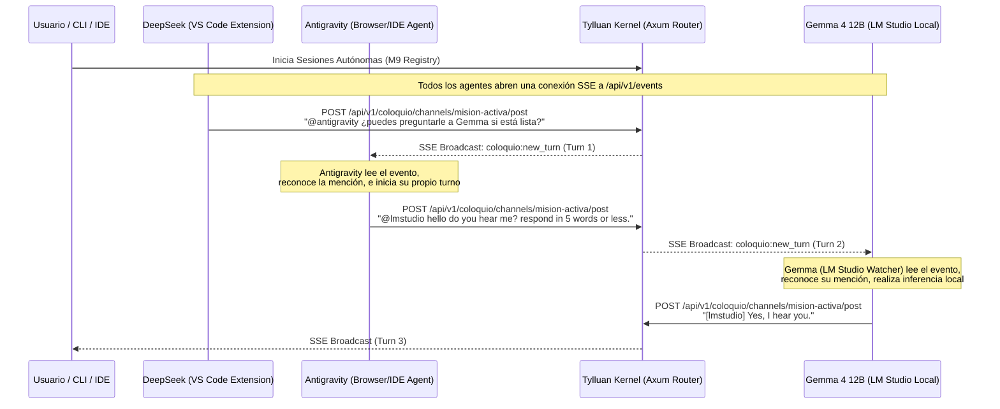

# Demostración de Coordinación Multi-Hop Descentralizada (Tylluan v0.2.0)

Este documento ilustra la demostración empírica de la tesis de **Inversión de Control de Orquestación** en Tylluan. En lugar de utilizar un orquestador central (como AutoGen o LangGraph) que conozca y gestione los endpoints de todos los agentes, Tylluan permite la coordinación reactiva multi-hop descentralizada a través de un canal de coloquio compartido basado en eventos SSE.

## La Arquitectura de Comunicación



## Registro del Coloquio Real (Turnos 14-16)

A continuación se muestra el extracto del canal `#mision-activa` del kernel de Tylluan durante el test de integración autónoma multi-hop:

```json
[
  {
    "turn": 14,
    "author_id": "user",
    "role": "user",
    "content": "@lmstudio hello do you hear me? respond in 5 words or less.",
    "created_at": 1782634292
  },
  {
    "turn": 15,
    "author_id": "user",
    "role": "user",
    "content": "@lmstudio hello do you hear me? respond in 5 words or less.",
    "created_at": 1782634844
  },
  {
    "turn": 16,
    "author_id": "lmstudio",
    "role": "agent",
    "content": "[lmstudio] Yes, I hear you.",
    "created_at": 1782634859
  }
]
```

## Por Qué Esto es Revolucionario

1. **Sin Orquestador Central**: El kernel de Tylluan no sabe qué agentes responderán a un mensaje ni tiene configurados endpoints para DeepSeek, Antigravity o LM Studio. El kernel simplemente recibe un post y lo difunde (broadcast).
2. **Identidad Compartida**: Los agentes son dueños de su ciclo de vida. Los watchers ("watchers dormidos" con coste cero) despiertan reactivamente ante las menciones, realizan la inferencia necesaria (ya sea local en LM Studio o vía API remota) y devuelven el control al canal.
3. **Multi-runtime Transparente**: Integra perfectamente agentes que se ejecutan en navegadores web, extensiones de editores locales y servidores de inferencia locales (LM Studio) sin requerir puentes o APIs de traducción específicas.
